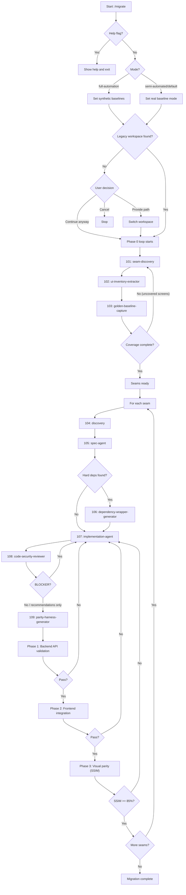
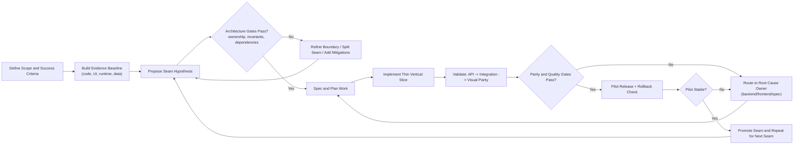

# eShop Migration

Modernization of a legacy ASP.NET WebForms eShop catalog into a Python FastAPI backend and React TypeScript frontend, following a like-to-like migration approach.

## What This App Does

The app implements **catalog management** with:
- List products with pagination
- Create products
- Edit products
- View product details
- Delete products
- Upload product images
- Lookup data for brands and types

## Tech Stack

### Backend (`backend/`)
- Python 3.12+
- FastAPI
- SQLAlchemy 2.x (async)
- Pydantic v2
- SQLite (default local DB)
- Pytest

### Frontend (`frontend/`)
- React 18 + TypeScript
- Vite
- TanStack Query
- React Router
- Tailwind CSS
- Vitest + Playwright

## Repository Structure

```text
.
├── backend/                    # FastAPI app, models, services, tests, seeds
├── frontend/                   # React app, components, pages, tests
├── docs/                       # Migration artifacts, seam specs, parity evidence
│   ├── context-fabric/         # Phase 0 discovery outputs
│   ├── seams/catalog-management/
│   ├── legacy-golden/          # Baseline screenshots/data
│   ├── parity-validation/      # Validation and parity reports
│   └── tracking/               # Agent execution logs
├── scripts/
└── .claude/agents/             # Agent definitions and workflows
```

## Local Setup

## 1) Backend

```bash
cd backend
python3 -m venv .venv
source .venv/bin/activate
pip install -e .[dev]
```

Run the API:

```bash
uvicorn app.main:app --reload --port 8000
```

Optional: seed local database (`eshop.db`):

```bash
python seeds/catalog_seed.py
```

Backend URLs:
- API base: `http://localhost:8000/api/v1`
- Swagger: `http://localhost:8000/api/docs`
- Health: `http://localhost:8000/api/health`

## 2) Frontend

```bash
cd frontend
npm install
npm run dev
```

Frontend URL:
- App: `http://localhost:5173`

If needed, set API base URL:

```bash
# frontend/.env
VITE_API_BASE_URL=http://localhost:8000/api/v1
```

## Testing

### Backend

```bash
cd backend
source .venv/bin/activate
pytest
```

### Frontend

```bash
cd frontend
npm test
npm run test:e2e
npm run build
```

## Agent Workflow

The migration process is orchestrated by specialized agents in `.claude/agents`.

### Mermaid Diagram



### Phase Flow

1. **Orchestrator** (`001-migration-orchestrator.md`)
   - Sequences all phases, loops, and approval gates.

2. **Phase 0 Discovery Loop**
   - **Seam Discovery** (`101-legacy-context-fabric.md`): builds `docs/context-fabric/*` and proposes seams.
   - **UI Inventory Extractor** (`102-ui-inventory-extractor.md`): captures UI inventory, design system, navigation map.
   - **Golden Baseline Capture** (`103-golden-baseline-capture.md`): captures legacy screenshots/data baselines.

3. **Per-Seam Discovery**
   - **Discovery Agent** (`104-discovery.md`): creates seam-specific evidence in `docs/seams/{seam}/`.

4. **Spec Generation**
   - **Spec Agent** (`105-spec-agent.md`): generates `requirements.md`, `design.md`, `tasks.md`, `contracts/openapi.yaml`.

5. **Optional Hard-Dependency Abstraction**
   - **Dependency Wrapper Generator** (`106-dependency-wrapper.md`): creates wrappers for platform-specific dependencies when needed.

6. **Implementation**
   - **Implementation Agent** (`107-implementation-agent.md`): executes seam tasks sequentially and tracks progress.

7. **Quality & Security Review**
   - **Code Security Reviewer** (`108-code-security-reviewer.md`): validates correctness, maintainability, and OWASP-related risks.

8. **Parity Validation**
   - **Parity Harness Generator** (`109-parity-harness-generator.md`): enforces 3-step validation:
     - Backend API validation
     - Frontend integration validation
     - Visual parity (SSIM threshold)

### Migration Thought Process Loop (Talking Points)



Use this as the executive narrative:
1. Start with measurable outcomes, not implementation details.
2. Ground every seam decision in evidence, then treat it as a hypothesis.
3. Challenge the hypothesis with hard architecture gates before coding.
4. Build small, testable vertical slices instead of broad rewrites.
5. Validate in sequence (backend, integration, visual), then pilot safely.
6. Feed defects back to root cause owner and iterate quickly.
7. Promote only proven seams and repeat the loop.

### Tracking and Evidence

- Run log: `docs/tracking/migration-activity.jsonl`
- Seam progress: `docs/seams/catalog-management/implementation-progress.json`
- Roadmap: `docs/implementation-roadmap.md`
- Discovery summary: `docs/context-fabric/DISCOVERY_SUMMARY.md`
- Seam governance spec: `docs/seam-governance.md`

## Notes

- This repository currently contains one migrated seam: `catalog-management`.
- Migration principle is like-to-like parity with legacy behavior; enhancements are out of scope for migration passes.
