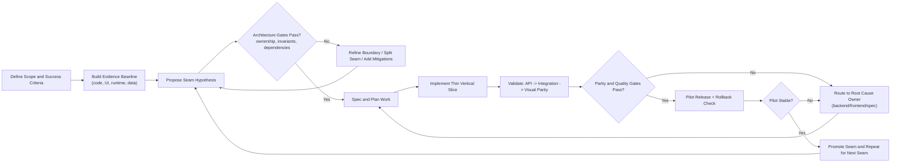
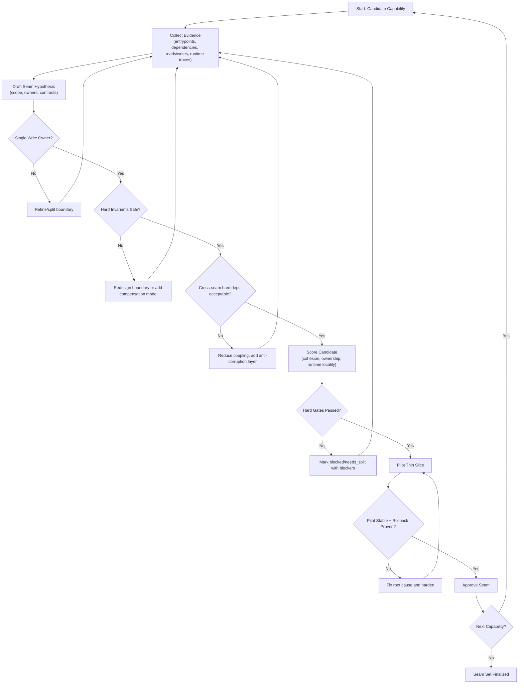

# Seam Governance Specification

Version: 1.0
Audience: Enterprise architects, platform teams, migration program leads
Scope: Large enterprise systems (2M to 3M LOC) using AI-assisted seam discovery and incremental modernization

## 1. Purpose

This specification defines how to identify, score, challenge, and approve seams with high confidence.

Goal:
- Move from "prompted guess" to governed architecture decisions.
- Replicate how experienced architects work over months: evidence, hypotheses, challenge, and pilot validation.

## 2. Expected Confidence

Use these confidence expectations:
- High: all mandatory artifacts complete, all hard gates pass, at least one pilot extraction validated.
- Medium: partial runtime evidence or unresolved boundary risks.
- Low: static analysis only, no invariant checks, no pilot validation.

This process increases confidence significantly. It does not guarantee zero risk.

## 3. Decision Principles

1. Capability-first boundaries: seams align to business capabilities, not technical layers.
2. Single write owner: one seam owns writes for each critical data set.
3. Invariant safety: do not split strong transactional invariants without compensation design.
4. Runtime truth over static assumptions: logs/traces and real workflows are authoritative.
5. Team alignment: each seam maps to a durable owning team.
6. Incremental extraction: prefer strangler style delivery over big-bang cuts.
7. Contract-first integration: cross-seam interaction only through explicit contracts.
8. Auditability: every claim references evidence.
9. Falsifiability: every seam hypothesis includes disconfirming tests.
10. Governance before commitment: no seam is approved until gates pass.

## 4. Operating Model

## 4.1 Roles

- Enterprise Architect: final boundary accountability.
- Domain Lead: validates business capability mapping.
- Platform Lead: validates deployability and observability readiness.
- Data Lead: validates data ownership and invariant constraints.
- AI Agent Orchestrator: sequences phases and enforces gates.

## 4.2 Agent Set

1. `context-fabric-agent`: builds code and system inventory.
2. `runtime-truth-agent`: extracts runtime traces, flow frequencies, and failure hotspots.
3. `invariant-mapper-agent`: identifies transactions, FK constraints, and consistency invariants.
4. `seam-hypothesis-agent`: generates seam candidates with assumptions and confidence.
5. `adversarial-review-agent`: attempts to disprove seam viability.
6. `pilot-planner-agent`: plans thin-slice extraction and rollback.
7. `governance-gate-agent`: computes scores and pass/fail decisions.

## 5. Lifecycle and Gates

## 5.0 Governance Loop Diagram (Thought Process)



Use this narrative when communicating the process:
1. Define business outcomes and measurable success criteria first.
2. Build evidence and treat seam boundaries as hypotheses, not facts.
3. Challenge hypotheses with hard architecture gates before coding.
4. Implement thin vertical slices to reduce migration blast radius.
5. Validate in sequence (API, integration, visual parity).
6. Route failures to root cause owners and iterate quickly.
7. Promote only pilot-proven seams and continue the loop.

## 5.0.1 Seam Decision Loop (Vertical)



Decision shorthand:
1. No single write owner means no seam approval.
2. Hard invariant risk means redesign before build.
3. Hard dependency cycles must be broken or isolated.
4. No pilot proof means no promotion to approved seam.

## 5.1 Phase A: Inventory and Evidence

Inputs:
- Source repositories
- Build manifests
- Architecture docs
- Telemetry and logs

Exit criteria:
- System manifest complete
- Delivery surfaces mapped
- Data read/write map produced
- Runtime top workflows identified

## 5.2 Phase B: Hypothesis Generation

Outputs:
- Candidate seams
- Owned writes and reads
- Dependency profile
- Assumptions and confidence per candidate

Exit criteria:
- 100% candidate seams include evidence references
- 100% candidates include disconfirming tests

## 5.3 Phase C: Adversarial Challenge

Checks:
- Shared-write conflicts
- Cross-seam FK violations
- Hard synchronous cycles
- Hidden runtime dependencies
- Team ownership ambiguity

Exit criteria:
- All blockers resolved, deferred with waiver, or candidate downgraded

## 5.4 Phase D: Pilot Validation

Run a thin-slice extraction for one candidate seam.

Pilot must prove:
- Independent deploy path
- Independent rollback path
- No critical invariant regressions
- SLO impact within agreed tolerance

Exit criteria:
- Pilot report approved by architecture board

## 5.5 Phase E: Approval and Rollout

Promotion rules:
- `approved`: all hard gates pass and pilot validated
- `needs_split`: boundary too broad or mixed ownership
- `blocked`: unresolved invariant/data/dependency blockers

## 6. Mandatory Artifacts

All artifacts are required for high-confidence approval.

1. `docs/context-fabric/manifest.json`
2. `docs/context-fabric/evidence-primitives.json`
3. `docs/context-fabric/data-ownership.json`
4. `docs/context-fabric/dependency-graph.json`
5. `docs/context-fabric/invariant-register.json`
6. `docs/context-fabric/runtime-flows.json`
7. `docs/context-fabric/seam-candidates.json`
8. `docs/context-fabric/seam-scores.json`
9. `docs/context-fabric/seam-proposals.json`
10. `docs/context-fabric/coverage-audit.json`
11. `docs/pilots/{seam}/pilot-plan.md`
12. `docs/pilots/{seam}/pilot-results.md`
13. `docs/governance/waivers.json` (only when needed)

## 7. Scoring Model

Use deterministic scoring. Scores are normalized to 0..100.

`score = 0.25*cohesion + 0.20*ownership_purity + 0.15*runtime_locality + 0.10*team_alignment + 0.10*operability - 0.10*hard_dependency_penalty - 0.05*shared_write_penalty - 0.05*invariant_risk`

Metric guidance:
- `cohesion`: internal dependency density and workflow coherence
- `ownership_purity`: percent of writes owned exclusively by candidate seam
- `runtime_locality`: percent of top runtime flows contained inside seam
- `team_alignment`: degree of clear team accountability
- `operability`: independent deploy, monitor, rollback readiness
- `hard_dependency_penalty`: unavoidable hard sync cross-boundary calls
- `shared_write_penalty`: overlap of write ownership with other seams
- `invariant_risk`: risk of splitting transactional invariants

Classification:
- 85 to 100: `approved`
- 70 to 84: `needs_split` or `needs_hardening`
- below 70: `blocked`

## 8. Hard Gates (Fail-fast)

Any hard gate failure means seam cannot be approved.

1. Coverage gate: >=95% of user and operational workflows mapped.
2. Evidence gate: 100% of seam claims have evidence references.
3. Data gate: no unresolved shared-write conflicts on critical entities.
4. Invariant gate: no split of hard invariants without approved compensation design.
5. Dependency gate: no unresolved hard synchronous cycles.
6. Operability gate: independent deploy and rollback path demonstrated.
7. Ownership gate: named team owner and on-call owner assigned.
8. Pilot gate: at least one successful pilot extraction for the pattern class.

## 9. Waiver Policy

Waivers are allowed only for non-critical risks and must include expiry.

Required waiver fields:
- `id`
- `seam`
- `risk_type`
- `business_justification`
- `mitigation_plan`
- `owner`
- `approved_by`
- `expires_on`

Expired waivers fail the gate automatically.

## 10. Agent Instruction Template

Use these instruction rules in Codex or Claude agents.

## 10.1 Universal Rules

1. Never invent facts.
2. Every finding must include `evidence_refs`.
3. Label each claim as `fact` or `inference`.
4. Emit confidence per item: `high`, `medium`, `low`.
5. If critical evidence is missing, emit blocker and stop.

## 10.2 Context Fabric Agent Prompt Snippet

```text
Build inventory and evidence primitives from source and runtime artifacts.
Do not propose seams yet.
Output: manifest.json, evidence-primitives.json, dependency-graph.json, data-ownership.json, runtime-flows.json, coverage-audit.json.
Every record must include evidence_refs.
```

## 10.3 Invariant Mapper Prompt Snippet

```text
Identify transactional and consistency invariants.
Classify invariants as hard or soft.
Flag candidate seam splits that violate hard invariants.
Output: invariant-register.json with owner, affected entities, and failure impact.
```

## 10.4 Seam Hypothesis Prompt Snippet

```text
Generate seam candidates from capability boundaries and owned writes.
For each candidate include assumptions, blockers, disconfirming_tests, and confidence.
No candidate may be approved without explicit disconfirming tests.
```

## 10.5 Adversarial Review Prompt Snippet

```text
Attempt to disprove each candidate seam.
Search for hidden dependencies, shared writes, FK break risks, and operational coupling.
Output blocker report with severity and evidence refs.
```

## 10.6 Governance Gate Prompt Snippet

```text
Compute deterministic seam score from published metrics.
Evaluate hard gates.
Set status: approved | needs_split | blocked.
Reject candidates with missing evidence or failed hard gates.
```

## 11. Pilot Rollout Playbook

1. Choose one low-blast-radius seam candidate with high score.
2. Implement contract and anti-corruption layer.
3. Route a small traffic slice to extracted seam.
4. Compare functional outputs with baseline.
5. Measure latency, error rate, rollback time.
6. Run failure injection tests for critical dependencies.
7. Approve pattern for broader rollout only after pilot sign-off.

## 12. Metrics and Reporting

Track weekly and monthly:
- Seam coverage percentage
- Number of approved seams
- Number of blocked seams by blocker type
- Shared-write conflict count
- Hard dependency cycle count
- Pilot success rate
- Rollback success rate
- DORA metrics by seam-owning team

## 13. Anti-patterns to Avoid

1. Layer-based seams (`UI`, `service`, `repository`) without capability ownership.
2. Shared database writes across multiple seams.
3. Approval without runtime evidence.
4. Skipping adversarial challenge.
5. Declaring microservices before operability readiness.
6. Large first extraction with no pilot.

## 14. Minimum Adoption Checklist

1. Configure all mandatory artifacts in CI.
2. Enforce hard gates in automation.
3. Assign named owners for seams and waivers.
4. Run adversarial review for every candidate.
5. Require pilot evidence before first production-scale extraction.
6. Review seam proposals in architecture board cadence.

## 15. Reference Gate Configuration (YAML)

```yaml
governance:
  hard_gates:
    coverage_min: 95
    evidence_required: true
    allow_shared_writes_critical: false
    allow_unresolved_sync_cycles: false
    require_independent_rollback: true
    require_named_owner: true
    require_pilot_success: true
  scoring:
    weights:
      cohesion: 0.25
      ownership_purity: 0.20
      runtime_locality: 0.15
      team_alignment: 0.10
      operability: 0.10
      hard_dependency_penalty: -0.10
      shared_write_penalty: -0.05
      invariant_risk: -0.05
    thresholds:
      approved_min: 85
      hardening_min: 70
  waiver:
    max_duration_days: 90
    require_expiry: true
```

## 16. Final Rule

A seam is not "real" until it is proven by:
- evidence,
- adversarial challenge,
- pilot validation,
- and operational ownership.

Everything else is a draft hypothesis.
