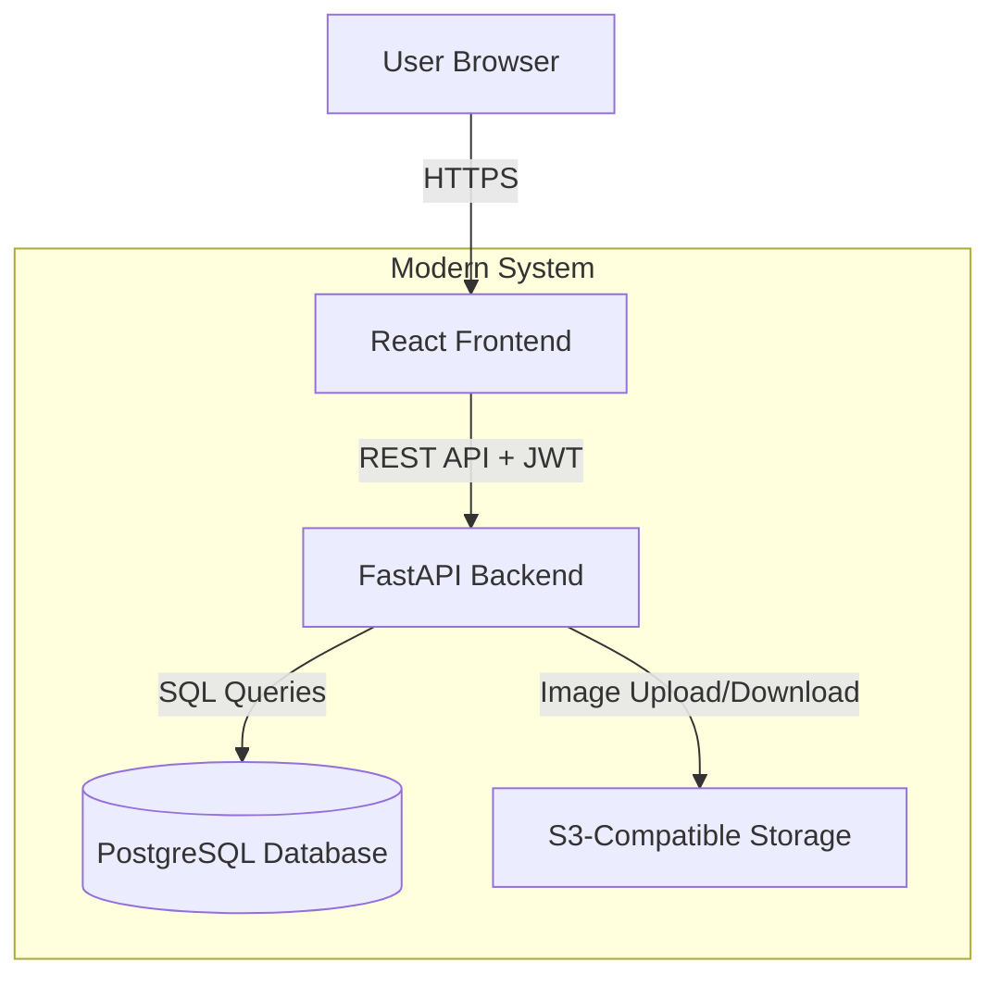
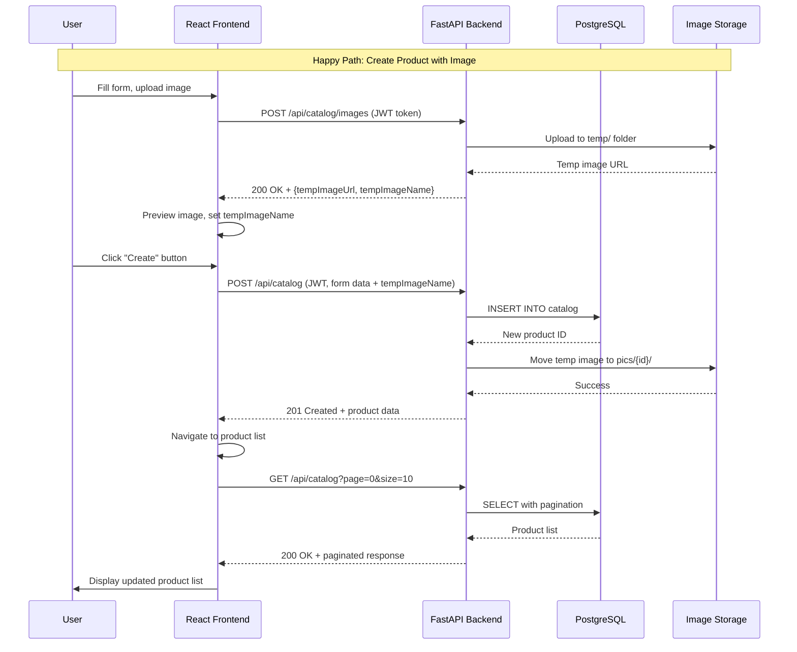

# Design Document: Catalog Management

## Overview

This design document specifies the technical architecture for migrating the catalog management seam from ASP.NET WebForms to a modern Python (FastAPI) backend and React TypeScript frontend. The design maintains complete functional parity with the legacy system while addressing security vulnerabilities (unauthenticated image upload), technical debt (HiLo sequence pattern), and performance limitations (synchronous I/O).

**Key Design Decisions:**
1. **Contract-First**: OpenAPI 3.1 specification drives both backend and frontend implementation
2. **Async-First**: All database and I/O operations use async/await (FastAPI + SQLAlchemy async)
3. **Interface-Based Abstractions**: IImageService adapter pattern enables swappable storage backends (S3, local filesystem)
4. **Stateless Authentication**: JWT bearer tokens replace OpenID Connect (no server-side sessions)
5. **Vertical Slice Architecture**: Single seam owns all catalog CRUD operations (no cross-seam dependencies)

**Relationship to Existing System:**
- **Database**: Reuses legacy schema (Catalog, CatalogBrand, CatalogType tables) with minor adjustments (HiLo → auto-increment)
- **Storage**: Replaces Azure Blob Storage with S3-compatible storage (MinIO or AWS S3)
- **Authentication**: Replaces OWIN OpenID Connect with FastAPI JWT middleware
- **UI**: Replaces server-rendered WebForms with client-rendered React SPA

---

## Architecture

### System Context



### Component Interaction



---

## Components & Interfaces

### Backend Components (Python/FastAPI)

**Module**: `backend/app/catalog/`

| Component | File | Type | Responsibilities |
|-----------|------|------|-----------------|
| Router | `router.py` | API endpoints | HTTP handling, request validation, authentication |
| Schemas | `schemas.py` | Pydantic models | Request/response DTOs, validation rules |
| Service | `service.py` | Business logic | Catalog CRUD operations, business rules |
| Models | `models.py` | SQLAlchemy models | Database entities (Catalog, CatalogBrand, CatalogType) |

#### CatalogRouter (router.py)

```python
# backend/app/catalog/router.py
from fastapi import APIRouter, Depends, HTTPException, UploadFile, File, status
from fastapi.responses import Response
from sqlalchemy.ext.asyncio import AsyncSession
from app.catalog.service import CatalogService
from app.catalog.schemas import (
    CatalogItemResponse,
    CatalogItemListResponse,
    CatalogItemCreate,
    CatalogItemUpdate,
    CatalogBrandResponse,
    CatalogTypeResponse,
    ImageUploadResponse,
)
from app.dependencies import get_db, get_current_user
from app.core.exceptions import NotFoundException
import structlog

logger = structlog.get_logger()
router = APIRouter(prefix="/api/catalog", tags=["Catalog"])


@router.get("", response_model=CatalogItemListResponse)
async def list_catalog_items(
    page: int = 0,
    size: int = 10,
    db: AsyncSession = Depends(get_db),
):
    """
    List catalog items with pagination.

    Implements:
    - Requirement 1.1 (list products with pagination)
    - Requirement 1.2 (page metadata)

    Query Parameters:
        page: Page index (0-based), default 0
        size: Items per page (1-100), default 10

    Returns:
        Paginated list of catalog items with brand and type
    """
    if page < 0:
        raise HTTPException(status_code=400, detail="Page index must be non-negative")
    if size <= 0 or size > 100:
        raise HTTPException(status_code=400, detail="Page size must be between 1 and 100")

    service = CatalogService(db)
    return await service.get_paginated(page=page, size=size)


@router.get("/{item_id}", response_model=CatalogItemResponse)
async def get_catalog_item(
    item_id: int,
    db: AsyncSession = Depends(get_db),
):
    """
    Get single catalog item by ID.

    Implements:
    - Requirement 2.1 (view product details)

    Path Parameters:
        item_id: Product ID (positive integer)

    Returns:
        Catalog item with brand and type

    Raises:
        404: Product not found
    """
    if item_id <= 0:
        raise HTTPException(status_code=400, detail="Product ID must be positive")

    service = CatalogService(db)
    item = await service.get_by_id(item_id)

    if item is None:
        raise NotFoundException("CatalogItem", str(item_id))

    return item


@router.post("", response_model=CatalogItemResponse, status_code=status.HTTP_201_CREATED)
async def create_catalog_item(
    item_data: CatalogItemCreate,
    db: AsyncSession = Depends(get_db),
    current_user: dict = Depends(get_current_user),
):
    """
    Create new catalog item (requires authentication).

    Implements:
    - Requirement 3.1 (create product with validation)
    - Requirement 3.2 (image association)

    Request Body:
        CatalogItemCreate schema with all fields

    Returns:
        Created catalog item with Location header

    Raises:
        400: Validation error
        401: Unauthenticated
    """
    service = CatalogService(db)
    created_item = await service.create(item_data)

    logger.info(
        "catalog.item.created",
        item_id=created_item.id,
        user_id=current_user.get("sub"),
    )

    return created_item


@router.put("/{item_id}", response_model=CatalogItemResponse)
async def update_catalog_item(
    item_id: int,
    item_data: CatalogItemUpdate,
    db: AsyncSession = Depends(get_db),
    current_user: dict = Depends(get_current_user),
):
    """
    Update existing catalog item (requires authentication).

    Implements:
    - Requirement 5.1 (update product)
    - Requirement 5.2 (image replacement)

    Path Parameters:
        item_id: Product ID

    Request Body:
        CatalogItemUpdate schema with all fields

    Returns:
        Updated catalog item

    Raises:
        404: Product not found
        401: Unauthenticated
    """
    if item_id <= 0:
        raise HTTPException(status_code=400, detail="Product ID must be positive")

    service = CatalogService(db)
    updated_item = await service.update(item_id, item_data)

    if updated_item is None:
        raise NotFoundException("CatalogItem", str(item_id))

    logger.info(
        "catalog.item.updated",
        item_id=item_id,
        user_id=current_user.get("sub"),
    )

    return updated_item


@router.delete("/{item_id}", status_code=status.HTTP_204_NO_CONTENT)
async def delete_catalog_item(
    item_id: int,
    db: AsyncSession = Depends(get_db),
    current_user: dict = Depends(get_current_user),
):
    """
    Delete catalog item (requires authentication).

    Implements:
    - Requirement 6.1 (delete product)
    - Requirement 6.2 (image cleanup)

    Path Parameters:
        item_id: Product ID

    Returns:
        204 No Content

    Raises:
        404: Product not found
        401: Unauthenticated
    """
    if item_id <= 0:
        raise HTTPException(status_code=400, detail="Product ID must be positive")

    service = CatalogService(db)
    deleted = await service.delete(item_id)

    if not deleted:
        raise NotFoundException("CatalogItem", str(item_id))

    logger.info(
        "catalog.item.deleted",
        item_id=item_id,
        user_id=current_user.get("sub"),
    )

    return Response(status_code=status.HTTP_204_NO_CONTENT)


@router.post("/images", response_model=ImageUploadResponse)
async def upload_catalog_image(
    file: UploadFile = File(...),
    db: AsyncSession = Depends(get_db),
    current_user: dict = Depends(get_current_user),
):
    """
    Upload product image to temporary storage (requires authentication).

    Implements:
    - Requirement 4.1 (authenticated image upload)
    - Requirement 4.2 (format/size validation)

    Request:
        Multipart form-data with file field

    Returns:
        Temp image URL and filename

    Raises:
        400: Invalid format or size
        401: Unauthenticated
    """
    service = CatalogService(db)
    return await service.upload_temp_image(file)


@router.get("/brands", response_model=list[CatalogBrandResponse])
async def list_catalog_brands(
    db: AsyncSession = Depends(get_db),
):
    """
    List all catalog brands (reference data).

    Implements:
    - Requirement 7.1 (list brands)

    Returns:
        Array of all brands (id, brand)
    """
    service = CatalogService(db)
    return await service.get_brands()


@router.get("/types", response_model=list[CatalogTypeResponse])
async def list_catalog_types(
    db: AsyncSession = Depends(get_db),
):
    """
    List all catalog types (reference data).

    Implements:
    - Requirement 8.1 (list types)

    Returns:
        Array of all types (id, type)
    """
    service = CatalogService(db)
    return await service.get_types()
```

#### CatalogService (service.py)

```python
# backend/app/catalog/service.py
from sqlalchemy import select, func
from sqlalchemy.ext.asyncio import AsyncSession
from sqlalchemy.orm import selectinload
from fastapi import UploadFile, HTTPException
from decimal import Decimal
from app.catalog.models import CatalogItem, CatalogBrand, CatalogType
from app.catalog.schemas import (
    CatalogItemCreate,
    CatalogItemUpdate,
    CatalogItemResponse,
    CatalogItemListResponse,
    CatalogBrandResponse,
    CatalogTypeResponse,
    ImageUploadResponse,
    PaginationMetadata,
)
from app.adapters.image_service import IImageService
from app.dependencies import get_image_service
import structlog
from typing import Optional

logger = structlog.get_logger()


class CatalogService:
    """Service for catalog management operations."""

    def __init__(self, db: AsyncSession):
        self.db = db
        self.image_service: IImageService = get_image_service()

    async def get_paginated(self, page: int, size: int) -> CatalogItemListResponse:
        """
        Retrieve paginated catalog items with brand and type.

        Implements:
        - Requirement 1.1 (list with pagination)
        - Requirement 1.2 (page metadata)
        """
        # Total count
        count_stmt = select(func.count(CatalogItem.id))
        total_items = await self.db.scalar(count_stmt)

        # Paginated query
        stmt = (
            select(CatalogItem)
            .options(
                selectinload(CatalogItem.catalog_brand),
                selectinload(CatalogItem.catalog_type),
            )
            .order_by(CatalogItem.id)
            .offset(page * size)
            .limit(size)
        )

        result = await self.db.execute(stmt)
        items = result.scalars().all()

        # Build image URIs
        items_with_uris = []
        for item in items:
            item_dict = CatalogItemResponse.model_validate(item).model_dump()
            item_dict["picture_uri"] = self.image_service.build_image_url(item.picture_filename)
            items_with_uris.append(CatalogItemResponse(**item_dict))

        total_pages = (total_items + size - 1) // size if total_items > 0 else 0

        return CatalogItemListResponse(
            items=items_with_uris,
            pagination=PaginationMetadata(
                page_index=page,
                page_size=size,
                total_items=total_items,
                total_pages=total_pages,
            ),
        )

    async def get_by_id(self, item_id: int) -> Optional[CatalogItemResponse]:
        """
        Retrieve single catalog item by ID.

        Implements:
        - Requirement 2.1 (view details)
        """
        stmt = (
            select(CatalogItem)
            .options(
                selectinload(CatalogItem.catalog_brand),
                selectinload(CatalogItem.catalog_type),
            )
            .where(CatalogItem.id == item_id)
        )

        result = await self.db.execute(stmt)
        item = result.scalar_one_or_none()

        if item is None:
            return None

        item_dict = CatalogItemResponse.model_validate(item).model_dump()
        item_dict["picture_uri"] = self.image_service.build_image_url(item.picture_filename)

        return CatalogItemResponse(**item_dict)

    async def create(self, item_data: CatalogItemCreate) -> CatalogItemResponse:
        """
        Create new catalog item with optional image.

        Implements:
        - Requirement 3.1 (create product)
        - Requirement 3.2 (image association)
        """
        # Validate foreign keys
        await self._validate_brand_exists(item_data.catalog_brand_id)
        await self._validate_type_exists(item_data.catalog_type_id)

        # Set default picture filename
        picture_filename = "dummy.png"

        # If temp image provided, move to permanent storage
        if item_data.temp_image_name:
            try:
                picture_filename = await self.image_service.move_temp_image(
                    item_data.temp_image_name,
                    item_id=None,  # ID not yet generated
                )
            except Exception as e:
                logger.warning("Failed to move temp image, using default", error=str(e))
                picture_filename = "dummy.png"

        # Create item
        item = CatalogItem(
            name=item_data.name,
            description=item_data.description,
            price=item_data.price,
            picture_filename=picture_filename,
            catalog_brand_id=item_data.catalog_brand_id,
            catalog_type_id=item_data.catalog_type_id,
            available_stock=item_data.available_stock,
            restock_threshold=item_data.restock_threshold,
            max_stock_threshold=item_data.max_stock_threshold,
            on_reorder=False,
        )

        self.db.add(item)
        await self.db.commit()
        await self.db.refresh(item)

        return await self.get_by_id(item.id)

    async def update(self, item_id: int, item_data: CatalogItemUpdate) -> Optional[CatalogItemResponse]:
        """
        Update existing catalog item with optional image replacement.

        Implements:
        - Requirement 5.1 (update product)
        - Requirement 5.2 (image replacement)
        """
        # Load existing item
        stmt = select(CatalogItem).where(CatalogItem.id == item_id)
        result = await self.db.execute(stmt)
        item = result.scalar_one_or_none()

        if item is None:
            return None

        # Validate foreign keys
        await self._validate_brand_exists(item_data.catalog_brand_id)
        await self._validate_type_exists(item_data.catalog_type_id)

        # Handle image replacement
        if item_data.temp_image_name:
            try:
                # Delete old images
                await self.image_service.delete_image(item.picture_filename, item_id)

                # Move temp image to permanent
                item.picture_filename = await self.image_service.move_temp_image(
                    item_data.temp_image_name,
                    item_id=item_id,
                )
            except Exception as e:
                logger.warning("Failed to replace image, keeping existing", error=str(e))

        # Update fields
        item.name = item_data.name
        item.description = item_data.description
        item.price = item_data.price
        item.catalog_brand_id = item_data.catalog_brand_id
        item.catalog_type_id = item_data.catalog_type_id
        item.available_stock = item_data.available_stock
        item.restock_threshold = item_data.restock_threshold
        item.max_stock_threshold = item_data.max_stock_threshold

        await self.db.commit()
        await self.db.refresh(item)

        return await self.get_by_id(item.id)

    async def delete(self, item_id: int) -> bool:
        """
        Delete catalog item and associated images.

        Implements:
        - Requirement 6.1 (delete product)
        - Requirement 6.2 (image cleanup)
        """
        stmt = select(CatalogItem).where(CatalogItem.id == item_id)
        result = await self.db.execute(stmt)
        item = result.scalar_one_or_none()

        if item is None:
            return False

        # Delete from database
        await self.db.delete(item)
        await self.db.commit()

        # Clean up image (best effort)
        try:
            await self.image_service.delete_image(item.picture_filename, item_id)
        except Exception as e:
            logger.warning("Failed to delete image after DB delete", error=str(e), item_id=item_id)

        return True

    async def upload_temp_image(self, file: UploadFile) -> ImageUploadResponse:
        """
        Upload product image to temporary storage.

        Implements:
        - Requirement 4.1 (authenticated upload)
        - Requirement 4.2 (validation)
        """
        # Validate file size (5MB max)
        file_size = 0
        contents = await file.read()
        file_size = len(contents)

        if file_size > 5 * 1024 * 1024:
            raise HTTPException(status_code=400, detail="File size must not exceed 5MB")

        # Validate file format
        allowed_formats = ["image/jpeg", "image/png", "image/gif"]
        if file.content_type not in allowed_formats:
            raise HTTPException(status_code=400, detail="Image format must be JPEG, PNG, or GIF")

        # Upload to temp storage
        try:
            result = await self.image_service.upload_temp_image(contents, file.filename)
            return result
        except Exception as e:
            logger.error("Image upload failed", error=str(e))
            raise HTTPException(status_code=500, detail="Image upload failed")

    async def get_brands(self) -> list[CatalogBrandResponse]:
        """
        Retrieve all catalog brands.

        Implements:
        - Requirement 7.1 (list brands)
        """
        stmt = select(CatalogBrand).order_by(CatalogBrand.id)
        result = await self.db.execute(stmt)
        brands = result.scalars().all()
        return [CatalogBrandResponse.model_validate(b) for b in brands]

    async def get_types(self) -> list[CatalogTypeResponse]:
        """
        Retrieve all catalog types.

        Implements:
        - Requirement 8.1 (list types)
        """
        stmt = select(CatalogType).order_by(CatalogType.id)
        result = await self.db.execute(stmt)
        types = result.scalars().all()
        return [CatalogTypeResponse.model_validate(t) for t in types]

    async def _validate_brand_exists(self, brand_id: int):
        """Validate that CatalogBrand exists."""
        stmt = select(CatalogBrand).where(CatalogBrand.id == brand_id)
        result = await self.db.execute(stmt)
        brand = result.scalar_one_or_none()

        if brand is None:
            raise HTTPException(
                status_code=400,
                detail=f"CatalogBrand with id '{brand_id}' not found"
            )

    async def _validate_type_exists(self, type_id: int):
        """Validate that CatalogType exists."""
        stmt = select(CatalogType).where(CatalogType.id == type_id)
        result = await self.db.execute(stmt)
        catalog_type = result.scalar_one_or_none()

        if catalog_type is None:
            raise HTTPException(
                status_code=400,
                detail=f"CatalogType with id '{type_id}' not found"
            )
```

#### Pydantic Schemas (schemas.py)

```python
# backend/app/catalog/schemas.py
from pydantic import BaseModel, Field, ConfigDict, field_validator
from decimal import Decimal
from typing import Optional


class CatalogBrandResponse(BaseModel):
    """Catalog brand reference data."""
    model_config = ConfigDict(from_attributes=True)

    id: int
    brand: str


class CatalogTypeResponse(BaseModel):
    """Catalog type reference data."""
    model_config = ConfigDict(from_attributes=True)

    id: int
    type: str


class CatalogItemResponse(BaseModel):
    """Catalog item response (read operations)."""
    model_config = ConfigDict(from_attributes=True)

    id: int
    name: str
    description: Optional[str] = None
    price: Decimal = Field(..., max_digits=18, decimal_places=2)
    picture_filename: str
    picture_uri: str  # Computed field
    catalog_brand: CatalogBrandResponse
    catalog_type: CatalogTypeResponse
    available_stock: int
    restock_threshold: int
    max_stock_threshold: int
    on_reorder: bool


class CatalogItemCreate(BaseModel):
    """Catalog item creation request."""
    name: str = Field(..., max_length=50, min_length=1)
    description: Optional[str] = None
    price: Decimal = Field(..., ge=0, le=1_000_000, max_digits=18, decimal_places=2)
    catalog_brand_id: int = Field(..., gt=0)
    catalog_type_id: int = Field(..., gt=0)
    available_stock: int = Field(..., ge=0, le=10_000_000)
    restock_threshold: int = Field(..., ge=0, le=10_000_000)
    max_stock_threshold: int = Field(..., ge=0, le=10_000_000)
    temp_image_name: Optional[str] = None

    @field_validator("price")
    @classmethod
    def validate_price_decimals(cls, v: Decimal) -> Decimal:
        """Validate price has max 2 decimal places."""
        if v.as_tuple().exponent < -2:
            raise ValueError("Price must have maximum 2 decimal places")
        return v


class CatalogItemUpdate(BaseModel):
    """Catalog item update request."""
    name: str = Field(..., max_length=50, min_length=1)
    description: Optional[str] = None
    price: Decimal = Field(..., ge=0, le=1_000_000, max_digits=18, decimal_places=2)
    catalog_brand_id: int = Field(..., gt=0)
    catalog_type_id: int = Field(..., gt=0)
    available_stock: int = Field(..., ge=0, le=10_000_000)
    restock_threshold: int = Field(..., ge=0, le=10_000_000)
    max_stock_threshold: int = Field(..., ge=0, le=10_000_000)
    temp_image_name: Optional[str] = None

    @field_validator("price")
    @classmethod
    def validate_price_decimals(cls, v: Decimal) -> Decimal:
        """Validate price has max 2 decimal places."""
        if v.as_tuple().exponent < -2:
            raise ValueError("Price must have maximum 2 decimal places")
        return v


class PaginationMetadata(BaseModel):
    """Pagination metadata."""
    page_index: int
    page_size: int
    total_items: int
    total_pages: int


class CatalogItemListResponse(BaseModel):
    """Paginated catalog item list response."""
    items: list[CatalogItemResponse]
    pagination: PaginationMetadata


class ImageUploadResponse(BaseModel):
    """Image upload response."""
    temp_image_url: str
    temp_image_name: str
```

---

### Frontend Components (React/TypeScript)

**Module**: `frontend/src/pages/catalog/`

| Component | File | Type | Responsibilities |
|-----------|------|------|-----------------|
| List Page | `CatalogListPage.tsx` | Top-level component | Data fetching, pagination, composition |
| Detail Page | `CatalogDetailPage.tsx` | Top-level component | Single item display, actions |
| Create Page | `CatalogCreatePage.tsx` | Top-level component | Form for new product |
| Edit Page | `CatalogEditPage.tsx` | Top-level component | Form for existing product |
| Table Component | `components/CatalogTable.tsx` | UI component | Product grid display |
| Form Component | `components/CatalogForm.tsx` | UI component | Shared create/edit form |
| Image Upload | `components/ImageUpload.tsx` | UI component | File upload with preview |
| API Client | `../../api/catalog.ts` | HTTP client | Type-safe API calls |
| Query Hook | `../../hooks/useCatalog.ts` | TanStack Query hook | Server state management |

#### CatalogListPage Component

```typescript
// frontend/src/pages/catalog/CatalogListPage.tsx
import { useState } from 'react';
import { useQuery } from '@tanstack/react-query';
import { Link } from 'react-router-dom';
import { catalogApi } from '@/api/catalog';
import { CatalogTable } from './components/CatalogTable';
import { Pagination } from '@/components/ui/Pagination';
import { Button } from '@/components/ui/button';
import { useAuth } from '@/hooks/useAuth';

export function CatalogListPage() {
  const [page, setPage] = useState(0);
  const [size] = useState(10);
  const { isAuthenticated } = useAuth();

  const { data, isLoading, error } = useQuery({
    queryKey: ['catalog', 'list', page, size],
    queryFn: () => catalogApi.listItems(page, size),
  });

  if (isLoading) {
    return (
      <div className="flex items-center justify-center h-64">
        <div className="animate-spin rounded-full h-12 w-12 border-b-2 border-gray-900" />
      </div>
    );
  }

  if (error) {
    return (
      <div className="p-4 bg-red-50 text-red-800 rounded-md">
        Error loading catalog: {error instanceof Error ? error.message : 'Unknown error'}
      </div>
    );
  }

  const { items, pagination } = data!;

  return (
    <div className="container mx-auto px-4 py-8">
      <div className="flex justify-between items-center mb-6">
        <h1 className="text-3xl font-bold">Catalog Manager</h1>
        {isAuthenticated && (
          <Link to="/catalog/create">
            <Button>Create New</Button>
          </Link>
        )}
      </div>

      <div className="mb-4 text-sm text-gray-600">
        Showing {pagination.page_size} of {pagination.total_items} products -
        Page {pagination.page_index + 1} - {pagination.total_pages}
      </div>

      <CatalogTable items={items} />

      <Pagination
        currentPage={page}
        totalPages={pagination.total_pages}
        onPageChange={setPage}
      />
    </div>
  );
}
```

#### API Client

```typescript
// frontend/src/api/catalog.ts
import { apiClient } from './client';
import type {
  CatalogItemListResponse,
  CatalogItemResponse,
  CatalogItemCreate,
  CatalogItemUpdate,
  CatalogBrandResponse,
  CatalogTypeResponse,
  ImageUploadResponse,
} from './types';

export const catalogApi = {
  async listItems(page: number = 0, size: number = 10): Promise<CatalogItemListResponse> {
    const response = await apiClient.get(`/catalog?page=${page}&size=${size}`);
    return response.data;
  },

  async getItem(id: number): Promise<CatalogItemResponse> {
    const response = await apiClient.get(`/catalog/${id}`);
    return response.data;
  },

  async createItem(data: CatalogItemCreate): Promise<CatalogItemResponse> {
    const response = await apiClient.post('/catalog', data);
    return response.data;
  },

  async updateItem(id: number, data: CatalogItemUpdate): Promise<CatalogItemResponse> {
    const response = await apiClient.put(`/catalog/${id}`, data);
    return response.data;
  },

  async deleteItem(id: number): Promise<void> {
    await apiClient.delete(`/catalog/${id}`);
  },

  async uploadImage(file: File): Promise<ImageUploadResponse> {
    const formData = new FormData();
    formData.append('file', file);

    const response = await apiClient.post('/catalog/images', formData, {
      headers: { 'Content-Type': 'multipart/form-data' },
    });
    return response.data;
  },

  async getBrands(): Promise<CatalogBrandResponse[]> {
    const response = await apiClient.get('/catalog/brands');
    return response.data;
  },

  async getTypes(): Promise<CatalogTypeResponse[]> {
    const response = await apiClient.get('/catalog/types');
    return response.data;
  },
};
```

---

## Data Models

### Backend Data Models (SQLAlchemy)

#### CatalogItem Entity

**Table**: `catalog`

| Field | Type | Column | Constraints | Notes |
|-------|------|--------|-------------|-------|
| `id` | `int` | `id` | Primary key, auto-increment | Replaces HiLo sequence |
| `name` | `str` | `name` | NOT NULL, max 50 chars | Required field |
| `description` | `str` | `description` | Nullable | Optional field |
| `price` | `Decimal` | `price` | NOT NULL, DECIMAL(18,2) | Currency, 0-1M range |
| `picture_filename` | `str` | `picture_filename` | NOT NULL | Filename only, NOT full URL |
| `catalog_brand_id` | `int` | `catalog_brand_id` | NOT NULL, Foreign Key | References CatalogBrand.id |
| `catalog_type_id` | `int` | `catalog_type_id` | NOT NULL, Foreign Key | References CatalogType.id |
| `available_stock` | `int` | `available_stock` | NOT NULL | 0-10M range |
| `restock_threshold` | `int` | `restock_threshold` | NOT NULL | 0-10M range |
| `max_stock_threshold` | `int` | `max_stock_threshold` | NOT NULL | 0-10M range |
| `on_reorder` | `bool` | `on_reorder` | NOT NULL, default False | Internal state |

**Relationships**:
- `catalog_brand` → CatalogBrand (many-to-one)
- `catalog_type` → CatalogType (many-to-one)

**Migration Note**: Existing database schema is preserved except for ID generation (HiLo → auto-increment).

```python
# backend/app/catalog/models.py
from sqlalchemy import Column, Integer, String, Text, DECIMAL, Boolean, ForeignKey
from sqlalchemy.orm import relationship
from app.core.database import Base


class CatalogItem(Base):
    __tablename__ = "catalog"

    id = Column(Integer, primary_key=True, autoincrement=True)
    name = Column(String(50), nullable=False, index=True)
    description = Column(Text, nullable=True)
    price = Column(DECIMAL(18, 2), nullable=False)
    picture_filename = Column(String(255), nullable=False)
    catalog_brand_id = Column(Integer, ForeignKey("catalog_brand.id"), nullable=False, index=True)
    catalog_type_id = Column(Integer, ForeignKey("catalog_type.id"), nullable=False, index=True)
    available_stock = Column(Integer, nullable=False)
    restock_threshold = Column(Integer, nullable=False)
    max_stock_threshold = Column(Integer, nullable=False)
    on_reorder = Column(Boolean, nullable=False, default=False)

    # Relationships
    catalog_brand = relationship("CatalogBrand", back_populates="catalog_items")
    catalog_type = relationship("CatalogType", back_populates="catalog_items")


class CatalogBrand(Base):
    __tablename__ = "catalog_brand"

    id = Column(Integer, primary_key=True, autoincrement=True)
    brand = Column(String(100), nullable=False)

    # Relationships
    catalog_items = relationship("CatalogItem", back_populates="catalog_brand")


class CatalogType(Base):
    __tablename__ = "catalog_type"

    id = Column(Integer, primary_key=True, autoincrement=True)
    type = Column(String(100), nullable=False)

    # Relationships
    catalog_items = relationship("CatalogItem", back_populates="catalog_type")
```

### Frontend Data Models (TypeScript)

```typescript
// frontend/src/api/types.ts (generated from OpenAPI contract)
export interface CatalogBrandResponse {
  id: number;
  brand: string;
}

export interface CatalogTypeResponse {
  id: number;
  type: string;
}

export interface CatalogItemResponse {
  id: number;
  name: string;
  description: string | null;
  price: number;
  picture_filename: string;
  picture_uri: string;
  catalog_brand: CatalogBrandResponse;
  catalog_type: CatalogTypeResponse;
  available_stock: number;
  restock_threshold: number;
  max_stock_threshold: number;
  on_reorder: boolean;
}

export interface CatalogItemCreate {
  name: string;
  description?: string | null;
  price: number;
  catalog_brand_id: number;
  catalog_type_id: number;
  available_stock: number;
  restock_threshold: number;
  max_stock_threshold: number;
  temp_image_name?: string | null;
}

export interface CatalogItemUpdate {
  name: string;
  description?: string | null;
  price: number;
  catalog_brand_id: number;
  catalog_type_id: number;
  available_stock: number;
  restock_threshold: number;
  max_stock_threshold: number;
  temp_image_name?: string | null;
}

export interface PaginationMetadata {
  page_index: number;
  page_size: number;
  total_items: number;
  total_pages: number;
}

export interface CatalogItemListResponse {
  items: CatalogItemResponse[];
  pagination: PaginationMetadata;
}

export interface ImageUploadResponse {
  temp_image_url: string;
  temp_image_name: string;
}
```

---

## API Specification

### Endpoint Summary

| Method | Path | Auth | Description |
|--------|------|------|-------------|
| GET | `/api/catalog` | No | List products with pagination |
| GET | `/api/catalog/{id}` | No | Get single product |
| POST | `/api/catalog` | Yes (JWT) | Create product |
| PUT | `/api/catalog/{id}` | Yes (JWT) | Update product |
| DELETE | `/api/catalog/{id}` | Yes (JWT) | Delete product |
| POST | `/api/catalog/images` | Yes (JWT) | Upload temp image |
| GET | `/api/catalog/brands` | No | List brands |
| GET | `/api/catalog/types` | No | List types |

### Detailed Endpoint Specifications

(See `contracts/openapi.yaml` for complete OpenAPI 3.1 specification)

**Authentication**: JWT Bearer token in `Authorization` header for protected endpoints.

**Error Responses**: All endpoints return consistent error format:

```json
{
  "detail": "Error message",
  "correlation_id": "uuid-string"
}
```

---

## Non-Functional Requirements

### Performance
- **Response Time**: API P95 latency < 500ms (list), < 200ms (single item)
- **Database Queries**: Use indexes on `id`, `catalog_brand_id`, `catalog_type_id`
- **Connection Pooling**: Async connection pool size 5-10
- **Image Upload**: Complete within 10 seconds for 5MB file

### Security
- **Authentication**: JWT RS256 tokens with expiration
- **Authorization**: Role-based (USER role minimum for write operations)
- **Input Validation**: Pydantic validation (backend), Zod validation (frontend)
- **SQL Injection**: Prevented via SQLAlchemy ORM (no raw SQL)
- **File Upload**: Size limit 5MB, format validation (JPEG, PNG, GIF)
- **CORS**: Configured for specific origins (no wildcard in production)
- **Rate Limiting**: 10 image uploads per minute per user

### Observability
- **Logging**: All API requests logged (method, path, status, duration, user_id) using structlog
- **Metrics**: Track request count, error rate, latency (P50, P95, P99)
- **Correlation IDs**: Propagate through all log entries
- **Health Check**: `GET /health` endpoint (returns 200 if DB accessible)

### Resilience
- **Timeouts**: Database query timeout 30 seconds, image upload timeout 10 seconds
- **Error Handling**: Graceful degradation (log error, return 500 with correlation ID)
- **Retry Logic**: No automatic retries (client-side responsibility)
- **Circuit Breaker**: Not implemented (single seam, no external service dependencies)

---

## Error Handling

### Error Taxonomy

| Category | HTTP Status | Example |
|----------|-------------|---------|
| Validation Error | 400 | Invalid query parameter, required field missing |
| Authentication Error | 401 | Missing or invalid JWT token |
| Authorization Error | 403 | User lacks permission (not implemented in MVP) |
| Not Found Error | 404 | Product ID does not exist |
| Conflict Error | 409 | Foreign key violation (e.g., cannot delete referenced brand) |
| Infrastructure Error | 500 | Database connection failure |
| Service Unavailable | 503 | Image service unavailable |
| Timeout Error | 504 | Database query timeout |

### Error Response Format

```json
{
  "detail": "Human-readable error message",
  "correlation_id": "uuid-for-tracing",
  "field": "field_name (for validation errors)"
}
```

### Per-Component Error Handling

- **Router**: Catch all exceptions, map to HTTP status codes, return structured error response
- **Service**: Throw domain-specific exceptions (HTTPException with appropriate status)
- **Database**: Catch SQLAlchemy exceptions, wrap in HTTPException(500)
- **Image Service**: Catch storage exceptions, wrap in HTTPException(500 or 503)

---

## Testing Strategy

### Testability Analysis

| Requirement | Criterion | Test Type | Test Class | Key Assertion |
|-------------|-----------|-----------|------------|---------------|
| 1.1 | List items returns data | Unit | `TestCatalogService::test_get_paginated` | Verify items returned, pagination metadata correct |
| 1.2 | Pagination works | Unit | `TestCatalogService::test_get_paginated_page_2` | Verify page/limit applied, offset calculation |
| 1.3 | Page metadata correct | Unit | `TestCatalogService::test_pagination_metadata` | Verify total_items, total_pages computed |
| 1.1 | API returns 200 | Integration | `TestCatalogAPI::test_list_catalog_items` | Verify HTTP 200 + JSON response |
| 2.1 | Get item by ID | Unit | `TestCatalogService::test_get_by_id` | Verify item returned with brand/type |
| 2.1 | Item not found | Unit | `TestCatalogService::test_get_by_id_not_found` | Verify None returned |
| 2.1 | API returns 404 | Integration | `TestCatalogAPI::test_get_item_not_found` | Verify HTTP 404 |
| 3.1 | Create item | Unit | `TestCatalogService::test_create` | Verify item created with all fields |
| 3.2 | Create with image | Unit | `TestCatalogService::test_create_with_temp_image` | Verify image moved from temp to permanent |
| 3.1 | API returns 201 | Integration | `TestCatalogAPI::test_create_item` | Verify HTTP 201 + Location header |
| 3.1 | Create requires auth | Integration | `TestCatalogAPI::test_create_item_unauthenticated` | Verify HTTP 401 |
| 4.1 | Upload image | Unit | `TestCatalogService::test_upload_temp_image` | Verify temp image stored, URL returned |
| 4.2 | Upload requires auth | Integration | `TestCatalogAPI::test_upload_image_unauthenticated` | Verify HTTP 401 |
| 4.2 | Upload validates size | Unit | `TestCatalogService::test_upload_image_too_large` | Verify HTTPException(400) |
| 5.1 | Update item | Unit | `TestCatalogService::test_update` | Verify item updated |
| 5.2 | Update with image | Unit | `TestCatalogService::test_update_with_image_replacement` | Verify old image deleted, new image moved |
| 6.1 | Delete item | Unit | `TestCatalogService::test_delete` | Verify item deleted from DB |
| 6.2 | Delete cleans up image | Unit | `TestCatalogService::test_delete_with_image_cleanup` | Verify image service called |
| 1.1 | UI displays items | E2E | Playwright: `test_catalog_list_displays_items` | Verify grid renders with data |
| 3.1 | UI create form | E2E | Playwright: `test_create_product_flow` | Verify form submission, redirect to list |

### Test Infrastructure

#### Backend (pytest)

**Fixtures**:
```python
# backend/tests/conftest.py
import pytest
from sqlalchemy.ext.asyncio import create_async_engine, AsyncSession
from sqlalchemy.orm import sessionmaker
from app.catalog.models import Base, CatalogItem, CatalogBrand, CatalogType

@pytest.fixture
async def db_session():
    """Create test database session."""
    engine = create_async_engine("sqlite+aiosqlite:///:memory:")
    async with engine.begin() as conn:
        await conn.run_sync(Base.metadata.create_all)

    async_session = sessionmaker(engine, class_=AsyncSession, expire_on_commit=False)
    async with async_session() as session:
        yield session

    await engine.dispose()

@pytest.fixture
async def sample_brand(db_session):
    """Create sample brand."""
    brand = CatalogBrand(id=1, brand="Test Brand")
    db_session.add(brand)
    await db_session.commit()
    return brand

@pytest.fixture
async def sample_type(db_session):
    """Create sample type."""
    catalog_type = CatalogType(id=1, type="Test Type")
    db_session.add(catalog_type)
    await db_session.commit()
    return catalog_type
```

#### Frontend (vitest + Playwright)

**Mocks**:
```typescript
// frontend/src/api/__mocks__/catalog.ts
import { rest } from 'msw';

export const catalogHandlers = [
  rest.get('/api/catalog', (req, res, ctx) => {
    return res(ctx.json({
      items: [
        { id: 1, name: 'Product 1', price: 99.99, /* ... */ },
        { id: 2, name: 'Product 2', price: 149.99, /* ... */ },
      ],
      pagination: {
        page_index: 0,
        page_size: 10,
        total_items: 2,
        total_pages: 1,
      },
    }));
  }),
];
```

### Coverage Targets

- **Backend**: ≥80% coverage on `service.py`, `router.py`
- **Frontend**: ≥75% coverage on hooks, pages

---

## Migration from Legacy Patterns

| Legacy Pattern | Modern Equivalent | Migration Notes |
|----------------|-------------------|-----------------|
| ASP.NET WebForms Page_Load | GET request handler | Replace server-side rendering with REST API |
| Button_Click postback | POST/PUT/DELETE handler | Replace postback with fetch() API call |
| ViewState | React useState | Client-side state management |
| Server.MapPath | Environment variable (IMAGE_STORAGE_PATH) | Configuration via pydantic-settings |
| Entity Framework 6 | SQLAlchemy 2.x async | Async queries, type-safe ORM |
| Autofac property injection | FastAPI Depends() | Explicit dependency injection |
| IImageService (C#) | IImageService (Python ABC) | Same adapter pattern, different language |
| HiLo sequence | Auto-increment PRIMARY KEY | Data migration required |
| OpenID Connect | JWT bearer tokens | Stateless authentication |
| log4net | structlog (JSON) | Structured logging |

---

## Deployment Architecture

### Backend Deployment

- **Container**: Docker image with Python 3.12 + FastAPI
- **Server**: Uvicorn with multiple workers (4-8 workers)
- **Database**: PostgreSQL 13+ with async connection pooling
- **Storage**: MinIO (S3-compatible) or AWS S3
- **Environment**: Kubernetes or Docker Compose

### Frontend Deployment

- **Build**: Vite production build (minified, optimized)
- **Server**: Nginx serving static assets
- **CDN**: Optional (CloudFlare, AWS CloudFront)
- **Environment**: Kubernetes or static hosting (Vercel, Netlify)

---

## Security Design

### Authentication Flow

1. User submits credentials to `/api/auth/login`
2. Backend validates credentials, generates JWT token (RS256 algorithm)
3. Token includes claims: `sub` (user ID), `exp` (expiration), `roles` (future)
4. Frontend stores token in memory (not localStorage)
5. Frontend includes token in `Authorization: Bearer <token>` header
6. Backend validates token signature and expiration on protected endpoints

### Authorization (Future Enhancement)

- Role-based access control (RBAC)
- Roles: `ADMIN`, `USER`, `VIEWER`
- Protected operations: CREATE, UPDATE, DELETE require `USER` or `ADMIN` role

---

**Document Version**: 1.0
**Last Updated**: 2026-03-03
**Status**: Ready for Task Breakdown
