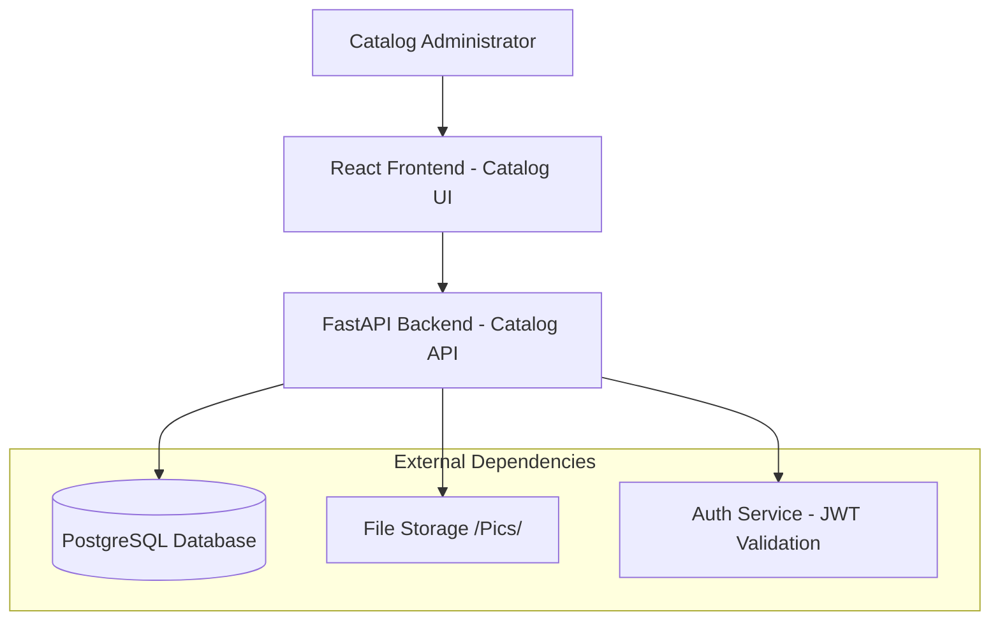
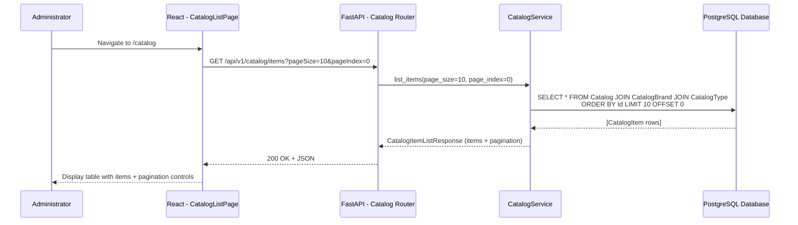
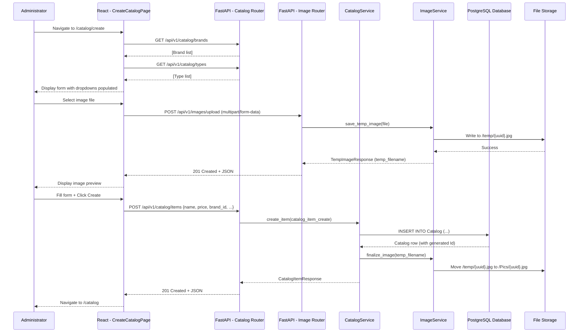

# Design Document: Catalog Management

## Overview

This design document specifies the technical architecture for the catalog management seam, transforming the legacy ASP.NET WebForms implementation into a modern Python FastAPI backend with React frontend. The design follows a vertical slice architecture where the catalog management seam is self-contained with dedicated backend routes, services, and frontend pages.

**Key Design Decisions:**
1. **Vertical Slice Architecture**: All catalog management code lives in `backend/app/catalog/` and `frontend/src/pages/catalog/`, ensuring clear boundaries and minimal coupling
2. **Contract-First API Design**: OpenAPI specification drives backend and frontend implementation, ensuring type safety and consistency
3. **Eager Loading for Performance**: Brand and Type data are always loaded with catalog items to avoid N+1 queries
4. **Image Handling Strategy**: Preserve legacy "/Pics/" directory structure for compatibility, but abstract storage behind Image_Service for future cloud migration
5. **Like-to-Like Migration**: Preserve exact legacy behaviors including default pagination (10 items), fixed sort order (Id ascending), and no image file cleanup on delete

**Relationship to Existing System:**
This seam replaces the legacy WebForms CRUD pages (`Default.aspx`, `Create.aspx`, `Edit.aspx`, `Delete.aspx`, `Details.aspx`) with React SPA routes and FastAPI endpoints. The underlying database schema (Catalog, CatalogBrand, CatalogType tables) remains unchanged, ensuring compatibility with other legacy services during the migration period.

---

## Architecture

### System Context



### Component Interaction - List Catalog Items



### Component Interaction - Create Catalog Item



---

## Components & Interfaces

### Backend Components

**Module**: `backend/app/catalog/`

| Component | File | Type | Responsibilities |
|-----------|------|------|-----------------|
| Router | `router.py` | API endpoints | HTTP handling, request validation, auth middleware |
| Schemas | `schemas.py` | Pydantic models | Request/response DTOs, validation rules |
| Service | `service.py` | Business logic | CRUD operations, business rules, pagination |
| Models | `models.py` | SQLAlchemy models | Database entities (Catalog, CatalogBrand, CatalogType) |

**Module**: `backend/app/images/`

| Component | File | Type | Responsibilities |
|-----------|------|------|-----------------|
| Router | `router.py` | API endpoints | Image upload endpoint |
| Service | `service.py` | Business logic | File upload, storage, temp file management |

---

#### CatalogService (backend/app/catalog/service.py)

```python
# backend/app/catalog/service.py

from sqlalchemy import select, func
from sqlalchemy.ext.asyncio import AsyncSession
from sqlalchemy.orm import selectinload
from app.catalog.models import CatalogItem, CatalogBrand, CatalogType
from app.catalog.schemas import (
    CatalogItemCreate,
    CatalogItemUpdate,
    CatalogItemResponse,
    CatalogItemListResponse,
    PaginationMetadata,
)
from app.core.exceptions import NotFoundException, ValidationError
from app.images.service import ImageService


class CatalogService:
    """
    Service for catalog item CRUD operations.

    Implements:
    - Requirement 1: List items with pagination
    - Requirement 2: Create item
    - Requirement 3: Edit item
    - Requirement 4: Delete item
    - Requirement 5: View item details
    """

    def __init__(self, db: AsyncSession, image_service: ImageService):
        self.db = db
        self.image_service = image_service

    async def list_items(
        self,
        page_size: int = 10,
        page_index: int = 0,
    ) -> CatalogItemListResponse:
        """
        Retrieve catalog items with pagination.

        Implements:
        - Requirement 1.1-1.14 (list and pagination)

        Args:
            page_size: Number of items per page (default: 10, max: 100)
            page_index: Zero-based page number (default: 0)

        Returns:
            CatalogItemListResponse with items and pagination metadata

        Raises:
            ValidationError: If page_size or page_index invalid
        """
        # Validation
        if page_size < 1 or page_size > 100:
            raise ValidationError("Invalid page size: must be between 1 and 100")
        if page_index < 0:
            raise ValidationError("Invalid page index: must be >= 0")

        # Count total items
        count_stmt = select(func.count(CatalogItem.id))
        total_items = await self.db.scalar(count_stmt)

        # Query items with eager loading
        stmt = (
            select(CatalogItem)
            .options(
                selectinload(CatalogItem.brand),
                selectinload(CatalogItem.type),
            )
            .order_by(CatalogItem.id.asc())
            .limit(page_size)
            .offset(page_size * page_index)
        )
        result = await self.db.execute(stmt)
        items = result.scalars().all()

        # Calculate pagination metadata
        total_pages = (total_items + page_size - 1) // page_size if total_items > 0 else 0

        return CatalogItemListResponse(
            items=[CatalogItemResponse.model_validate(item) for item in items],
            pagination=PaginationMetadata(
                page=page_index,
                limit=page_size,
                total_items=total_items,
                total_pages=total_pages,
            ),
        )

    async def get_item(self, item_id: int) -> CatalogItemResponse:
        """
        Retrieve catalog item by ID.

        Implements:
        - Requirement 3.1-3.2 (edit page load)
        - Requirement 5.1-5.2 (details page load)

        Args:
            item_id: Catalog item ID

        Returns:
            CatalogItemResponse

        Raises:
            NotFoundException: If item not found
        """
        stmt = (
            select(CatalogItem)
            .options(
                selectinload(CatalogItem.brand),
                selectinload(CatalogItem.type),
            )
            .where(CatalogItem.id == item_id)
        )
        result = await self.db.execute(stmt)
        item = result.scalar_one_or_none()

        if item is None:
            raise NotFoundException("Catalog item", str(item_id))

        return CatalogItemResponse.model_validate(item)

    async def create_item(self, catalog_item: CatalogItemCreate) -> CatalogItemResponse:
        """
        Create new catalog item.

        Implements:
        - Requirement 2.6-2.11 (create item)

        Args:
            catalog_item: Catalog item creation data

        Returns:
            CatalogItemResponse with generated ID

        Raises:
            ValidationError: If brand_id or type_id invalid
        """
        # Validate brand exists
        brand = await self.db.get(CatalogBrand, catalog_item.catalog_brand_id)
        if brand is None:
            raise ValidationError("Invalid brand ID")

        # Validate type exists
        type_ = await self.db.get(CatalogType, catalog_item.catalog_type_id)
        if type_ is None:
            raise ValidationError("Invalid type ID")

        # Handle image
        picture_filename = "dummy.png"
        if catalog_item.temp_image_name:
            picture_filename = await self.image_service.finalize_temp_image(
                catalog_item.temp_image_name
            )

        # Create database record
        db_item = CatalogItem(
            name=catalog_item.name,
            description=catalog_item.description,
            price=catalog_item.price,
            picture_file_name=picture_filename,
            catalog_type_id=catalog_item.catalog_type_id,
            catalog_brand_id=catalog_item.catalog_brand_id,
            available_stock=catalog_item.available_stock,
            restock_threshold=catalog_item.restock_threshold,
            max_stock_threshold=catalog_item.max_stock_threshold,
        )
        self.db.add(db_item)
        await self.db.commit()
        await self.db.refresh(db_item)

        # Eager load relationships
        await self.db.refresh(db_item, ["brand", "type"])

        return CatalogItemResponse.model_validate(db_item)

    async def update_item(
        self,
        item_id: int,
        catalog_item: CatalogItemUpdate,
    ) -> CatalogItemResponse:
        """
        Update existing catalog item.

        Implements:
        - Requirement 3.9-3.13 (update item)

        Args:
            item_id: Catalog item ID
            catalog_item: Updated catalog item data

        Returns:
            CatalogItemResponse

        Raises:
            NotFoundException: If item not found
            ValidationError: If brand_id or type_id invalid
        """
        # Retrieve existing item
        db_item = await self.db.get(CatalogItem, item_id)
        if db_item is None:
            raise NotFoundException("Catalog item", str(item_id))

        # Validate brand exists
        brand = await self.db.get(CatalogBrand, catalog_item.catalog_brand_id)
        if brand is None:
            raise ValidationError("Invalid brand ID")

        # Validate type exists
        type_ = await self.db.get(CatalogType, catalog_item.catalog_type_id)
        if type_ is None:
            raise ValidationError("Invalid type ID")

        # Handle image replacement
        if catalog_item.temp_image_name:
            picture_filename = await self.image_service.finalize_temp_image(
                catalog_item.temp_image_name
            )
            db_item.picture_file_name = picture_filename

        # Update fields
        db_item.name = catalog_item.name
        db_item.description = catalog_item.description
        db_item.price = catalog_item.price
        db_item.catalog_type_id = catalog_item.catalog_type_id
        db_item.catalog_brand_id = catalog_item.catalog_brand_id
        db_item.available_stock = catalog_item.available_stock
        db_item.restock_threshold = catalog_item.restock_threshold
        db_item.max_stock_threshold = catalog_item.max_stock_threshold

        await self.db.commit()
        await self.db.refresh(db_item, ["brand", "type"])

        return CatalogItemResponse.model_validate(db_item)

    async def delete_item(self, item_id: int) -> None:
        """
        Delete catalog item.

        Implements:
        - Requirement 4.6-4.9 (delete item)

        NOTE: Image file is NOT deleted from storage (legacy behavior).

        Args:
            item_id: Catalog item ID

        Raises:
            NotFoundException: If item not found
        """
        db_item = await self.db.get(CatalogItem, item_id)
        if db_item is None:
            raise NotFoundException("Catalog item", str(item_id))

        await self.db.delete(db_item)
        await self.db.commit()

        # NOTE: Legacy behavior - image file is NOT deleted from storage


class LookupService:
    """
    Service for brand and type lookups.

    Implements:
    - Requirement 6: Brand and Type lookups
    """

    def __init__(self, db: AsyncSession):
        self.db = db

    async def list_brands(self) -> list[CatalogBrand]:
        """
        Retrieve all brands ordered by name.

        Implements:
        - Requirement 6.1-6.3 (list brands)

        Returns:
            List of CatalogBrand entities
        """
        stmt = select(CatalogBrand).order_by(CatalogBrand.brand.asc())
        result = await self.db.execute(stmt)
        return result.scalars().all()

    async def list_types(self) -> list[CatalogType]:
        """
        Retrieve all types ordered by name.

        Implements:
        - Requirement 6.4-6.6 (list types)

        Returns:
            List of CatalogType entities
        """
        stmt = select(CatalogType).order_by(CatalogType.type.asc())
        result = await self.db.execute(stmt)
        return result.scalars().all()
```

---

#### ImageService (backend/app/images/service.py)

```python
# backend/app/images/service.py

import os
import uuid
import shutil
from pathlib import Path
from fastapi import UploadFile
from app.core.exceptions import ValidationError
import structlog

logger = structlog.get_logger()

ALLOWED_EXTENSIONS = {".jpg", ".jpeg", ".png"}
MAX_FILE_SIZE = 10 * 1024 * 1024  # 10MB


class ImageService:
    """
    Service for image upload and storage management.

    Implements:
    - Requirement 2.26-2.30 (image upload)
    - Requirement 3.18-3.22 (image replacement)
    """

    def __init__(self, storage_path: str = "./storage"):
        self.storage_path = Path(storage_path)
        self.temp_path = self.storage_path / "temp"
        self.pics_path = self.storage_path / "Pics"

        # Ensure directories exist
        self.temp_path.mkdir(parents=True, exist_ok=True)
        self.pics_path.mkdir(parents=True, exist_ok=True)

    async def save_temp_image(self, file: UploadFile) -> str:
        """
        Save uploaded image to temporary storage.

        Args:
            file: Uploaded file

        Returns:
            Temporary filename (UUID + extension)

        Raises:
            ValidationError: If file invalid
        """
        # Validate file extension
        file_ext = Path(file.filename).suffix.lower()
        if file_ext not in ALLOWED_EXTENSIONS:
            raise ValidationError(
                "Invalid image format: only jpg and png allowed"
            )

        # Read file content
        content = await file.read()

        # Validate file size
        if len(content) > MAX_FILE_SIZE:
            raise ValidationError("Image file too large: maximum 10MB")

        # Generate unique filename
        temp_filename = f"{uuid.uuid4()}{file_ext}"
        temp_file_path = self.temp_path / temp_filename

        # Write to temp storage
        with open(temp_file_path, "wb") as f:
            f.write(content)

        logger.info(
            "image.temp_saved",
            temp_filename=temp_filename,
            size_bytes=len(content),
        )

        return temp_filename

    async def finalize_temp_image(self, temp_filename: str) -> str:
        """
        Move temporary image to permanent storage.

        Args:
            temp_filename: Temporary filename from save_temp_image

        Returns:
            Final filename in /Pics/ directory

        Raises:
            ValidationError: If temp file not found
        """
        temp_file_path = self.temp_path / temp_filename

        if not temp_file_path.exists():
            raise ValidationError(f"Temporary image file not found: {temp_filename}")

        # Move to permanent storage
        final_file_path = self.pics_path / temp_filename
        shutil.move(str(temp_file_path), str(final_file_path))

        logger.info(
            "image.finalized",
            temp_filename=temp_filename,
            final_filename=temp_filename,
        )

        return temp_filename
```

---

### Frontend Components

**Module**: `frontend/src/pages/catalog/`

| Component | File | Type | Responsibilities |
|-----------|------|------|-----------------|
| List Page | `CatalogListPage.tsx` | Page component | Data fetching, table rendering, pagination |
| Create Page | `CreateCatalogPage.tsx` | Page component | Form handling, image upload, submission |
| Edit Page | `EditCatalogPage.tsx` | Page component | Load existing data, form handling, update |
| Delete Page | `DeleteCatalogPage.tsx` | Page component | Confirmation display, deletion |
| Details Page | `DetailsCatalogPage.tsx` | Page component | Read-only display |

**Module**: `frontend/src/components/catalog/`

| Component | File | Type | Responsibilities |
|-----------|------|------|-----------------|
| Table | `CatalogTable.tsx` | UI component | Table rendering with action buttons |
| Form | `CatalogForm.tsx` | UI component | Reusable form for create/edit |
| Image Upload | `ImageUpload.tsx` | UI component | Image file picker with preview |
| Pagination | `Pagination.tsx` | UI component | Next/Previous buttons |

**Module**: `frontend/src/api/`

| Component | File | Type | Responsibilities |
|-----------|------|------|-----------------|
| API Client | `catalog.ts` | HTTP client | Type-safe API calls |

**Module**: `frontend/src/hooks/`

| Component | File | Type | Responsibilities |
|-----------|------|------|-----------------|
| Query Hooks | `useCatalog.ts` | TanStack Query | Server state management |

---

#### CatalogListPage (frontend/src/pages/catalog/CatalogListPage.tsx)

```typescript
// frontend/src/pages/catalog/CatalogListPage.tsx

import { useState } from 'react';
import { useNavigate } from 'react-router-dom';
import { useCatalogItems } from '@/hooks/useCatalog';
import { CatalogTable } from '@/components/catalog/CatalogTable';
import { Pagination } from '@/components/catalog/Pagination';
import { Button } from '@/components/ui/button';

/**
 * Catalog list page with pagination.
 *
 * Implements:
 * - Requirement 1: List items with pagination
 *
 * UI Spec Reference: ui-specification.json > screens > CatalogList
 */
export function CatalogListPage() {
  const navigate = useNavigate();
  const [pageIndex, setPageIndex] = useState(0);
  const [pageSize] = useState(10); // Fixed page size per legacy

  const { data, isLoading, error } = useCatalogItems(pageSize, pageIndex);

  if (isLoading) {
    return <div className="flex justify-center p-8">Loading catalog items...</div>;
  }

  if (error) {
    return (
      <div className="text-red-600 p-4">
        Failed to load catalog items. Please try again.
      </div>
    );
  }

  const handlePrevious = () => {
    if (pageIndex > 0) {
      setPageIndex(pageIndex - 1);
    }
  };

  const handleNext = () => {
    if (data && pageIndex < data.pagination.total_pages - 1) {
      setPageIndex(pageIndex + 1);
    }
  };

  return (
    <div className="container mx-auto p-4">
      <div className="flex justify-between items-center mb-6">
        <h1 className="text-3xl font-bold">Index</h1>
        <Button onClick={() => navigate('/catalog/create')}>
          Create New
        </Button>
      </div>

      {data && data.items.length === 0 ? (
        <div className="text-gray-600 p-4">No catalog items found</div>
      ) : (
        <>
          <CatalogTable items={data?.items || []} />

          <Pagination
            pageIndex={pageIndex}
            totalPages={data?.pagination.total_pages || 0}
            onPrevious={handlePrevious}
            onNext={handleNext}
          />
        </>
      )}
    </div>
  );
}
```

---

#### CatalogForm (frontend/src/components/catalog/CatalogForm.tsx)

```typescript
// frontend/src/components/catalog/CatalogForm.tsx

import { useForm } from 'react-hook-form';
import { zodResolver } from '@hookform/resolvers/zod';
import { z } from 'zod';
import { useBrands, useTypes } from '@/hooks/useCatalog';
import { ImageUpload } from '@/components/catalog/ImageUpload';
import { Button } from '@/components/ui/button';
import { Input } from '@/components/ui/input';
import { Textarea } from '@/components/ui/textarea';
import { Select } from '@/components/ui/select';

/**
 * Validation schema matching backend Pydantic models.
 *
 * Implements validation rules from:
 * - Requirement 2.12-2.23 (create validation)
 * - Requirement 3.15 (edit validation)
 */
const catalogItemSchema = z.object({
  name: z.string()
    .min(1, "Name is required")
    .max(50, "Name must not exceed 50 characters"),
  description: z.string().optional(),
  price: z.number()
    .min(0, "Price must be greater than or equal to 0")
    .max(999999999.99, "Price must not exceed 999999999.99"),
  catalog_brand_id: z.number().min(1, "Brand is required"),
  catalog_type_id: z.number().min(1, "Type is required"),
  available_stock: z.number()
    .int()
    .min(0, "Available stock must be between 0 and 10000000")
    .max(10000000, "Available stock must be between 0 and 10000000"),
  restock_threshold: z.number()
    .int()
    .min(0, "Restock threshold must be between 0 and 10000000")
    .max(10000000, "Restock threshold must be between 0 and 10000000"),
  max_stock_threshold: z.number()
    .int()
    .min(0, "Max stock threshold must be between 0 and 10000000")
    .max(10000000, "Max stock threshold must be between 0 and 10000000"),
  temp_image_name: z.string().optional(),
});

type CatalogItemFormData = z.infer<typeof catalogItemSchema>;

interface CatalogFormProps {
  initialData?: Partial<CatalogItemFormData>;
  onSubmit: (data: CatalogItemFormData) => Promise<void>;
  onCancel: () => void;
  isEdit?: boolean;
  pictureFileName?: string;
}

/**
 * Reusable form for create and edit pages.
 *
 * UI Spec Reference: ui-specification.json > screens > CatalogCreate/CatalogEdit
 */
export function CatalogForm({
  initialData,
  onSubmit,
  onCancel,
  isEdit = false,
  pictureFileName,
}: CatalogFormProps) {
  const { data: brands } = useBrands();
  const { data: types } = useTypes();

  const {
    register,
    handleSubmit,
    setValue,
    formState: { errors, isSubmitting },
  } = useForm<CatalogItemFormData>({
    resolver: zodResolver(catalogItemSchema),
    defaultValues: initialData,
  });

  const handleImageUpload = (tempImageName: string) => {
    setValue('temp_image_name', tempImageName);
  };

  return (
    <form onSubmit={handleSubmit(onSubmit)} className="space-y-6 max-w-2xl">
      <div>
        <label className="block text-sm font-medium mb-2">Name</label>
        <Input {...register('name')} />
        {errors.name && (
          <p className="text-red-600 text-sm mt-1">{errors.name.message}</p>
        )}
      </div>

      <div>
        <label className="block text-sm font-medium mb-2">Description</label>
        <Textarea {...register('description')} rows={4} />
      </div>

      <div>
        <label className="block text-sm font-medium mb-2">Brand</label>
        <Select {...register('catalog_brand_id', { valueAsNumber: true })}>
          <option value="">Select a brand</option>
          {brands?.map((brand) => (
            <option key={brand.id} value={brand.id}>
              {brand.brand}
            </option>
          ))}
        </Select>
        {errors.catalog_brand_id && (
          <p className="text-red-600 text-sm mt-1">
            {errors.catalog_brand_id.message}
          </p>
        )}
      </div>

      <div>
        <label className="block text-sm font-medium mb-2">Type</label>
        <Select {...register('catalog_type_id', { valueAsNumber: true })}>
          <option value="">Select a type</option>
          {types?.map((type) => (
            <option key={type.id} value={type.id}>
              {type.type}
            </option>
          ))}
        </Select>
        {errors.catalog_type_id && (
          <p className="text-red-600 text-sm mt-1">
            {errors.catalog_type_id.message}
          </p>
        )}
      </div>

      <div>
        <label className="block text-sm font-medium mb-2">Price</label>
        <Input
          type="number"
          step="0.01"
          {...register('price', { valueAsNumber: true })}
        />
        {errors.price && (
          <p className="text-red-600 text-sm mt-1">{errors.price.message}</p>
        )}
      </div>

      <div className="grid grid-cols-3 gap-4">
        <div>
          <label className="block text-sm font-medium mb-2">
            Available Stock
          </label>
          <Input
            type="number"
            {...register('available_stock', { valueAsNumber: true })}
          />
          {errors.available_stock && (
            <p className="text-red-600 text-sm mt-1">
              {errors.available_stock.message}
            </p>
          )}
        </div>

        <div>
          <label className="block text-sm font-medium mb-2">
            Restock Threshold
          </label>
          <Input
            type="number"
            {...register('restock_threshold', { valueAsNumber: true })}
          />
          {errors.restock_threshold && (
            <p className="text-red-600 text-sm mt-1">
              {errors.restock_threshold.message}
            </p>
          )}
        </div>

        <div>
          <label className="block text-sm font-medium mb-2">
            Max Stock Threshold
          </label>
          <Input
            type="number"
            {...register('max_stock_threshold', { valueAsNumber: true })}
          />
          {errors.max_stock_threshold && (
            <p className="text-red-600 text-sm mt-1">
              {errors.max_stock_threshold.message}
            </p>
          )}
        </div>
      </div>

      {isEdit && pictureFileName && (
        <div>
          <label className="block text-sm font-medium mb-2">
            Picture name
            <span className="text-gray-500 ml-2 text-xs">
              (Not allowed for edition)
            </span>
          </label>
          <Input value={pictureFileName} disabled />
        </div>
      )}

      <ImageUpload
        onUpload={handleImageUpload}
        currentImage={pictureFileName}
      />

      <div className="flex gap-4">
        <Button type="submit" disabled={isSubmitting}>
          {isEdit ? 'Save' : 'Create'}
        </Button>
        <Button type="button" variant="outline" onClick={onCancel}>
          Cancel
        </Button>
      </div>
    </form>
  );
}
```

---

## Data Models

### Backend Data Model (SQLAlchemy)

#### Entity: CatalogItem

**Table**: `catalog` (legacy schema preserved)

| Field | Type | Column | Constraints | Notes |
|-------|------|--------|-------------|-------|
| `id` | `int` | `Id` | Primary key, auto-increment | Legacy HiLo replaced with auto-increment |
| `name` | `str` | `Name` | Not null, max 50 chars | Required |
| `description` | `str` | `Description` | Nullable | Optional |
| `price` | `Decimal` | `Price` | Not null, precision(18,2) | Currency field |
| `picture_file_name` | `str` | `PictureFileName` | Not null | Filename only, path constructed as "/Pics/{filename}" |
| `catalog_type_id` | `int` | `CatalogTypeId` | FK CatalogType.Id, not null | Required |
| `catalog_brand_id` | `int` | `CatalogBrandId` | FK CatalogBrand.Id, not null | Required |
| `available_stock` | `int` | `AvailableStock` | Not null, default 0 | Inventory level |
| `restock_threshold` | `int` | `RestockThreshold` | Not null, default 0 | Alert threshold |
| `max_stock_threshold` | `int` | `MaxStockThreshold` | Not null, default 0 | Maximum capacity |

**Relationships**:
- `brand`: Many-to-one with CatalogBrand (eager loaded)
- `type`: Many-to-one with CatalogType (eager loaded)

**Migration**: Not needed (using legacy database schema)

**SQLAlchemy Model**:
```python
# backend/app/catalog/models.py

from sqlalchemy import Column, Integer, String, Numeric, ForeignKey
from sqlalchemy.orm import relationship
from app.core.database import Base


class CatalogItem(Base):
    __tablename__ = "catalog"

    id = Column("Id", Integer, primary_key=True, index=True)
    name = Column("Name", String(50), nullable=False)
    description = Column("Description", String, nullable=True)
    price = Column("Price", Numeric(18, 2), nullable=False)
    picture_file_name = Column("PictureFileName", String, nullable=False)
    catalog_type_id = Column("CatalogTypeId", Integer, ForeignKey("catalogtype.Id"), nullable=False)
    catalog_brand_id = Column("CatalogBrandId", Integer, ForeignKey("catalogbrand.Id"), nullable=False)
    available_stock = Column("AvailableStock", Integer, nullable=False, default=0)
    restock_threshold = Column("RestockThreshold", Integer, nullable=False, default=0)
    max_stock_threshold = Column("MaxStockThreshold", Integer, nullable=False, default=0)

    # Relationships
    brand = relationship("CatalogBrand", lazy="select")
    type = relationship("CatalogType", lazy="select")

    @property
    def picture_uri(self) -> str:
        """Construct full picture URI."""
        return f"/Pics/{self.picture_file_name}"


class CatalogBrand(Base):
    __tablename__ = "catalogbrand"

    id = Column("Id", Integer, primary_key=True, index=True)
    brand = Column("Brand", String(100), nullable=False)


class CatalogType(Base):
    __tablename__ = "catalogtype"

    id = Column("Id", Integer, primary_key=True, index=True)
    type = Column("Type", String(100), nullable=False)
```

---

#### Entity: CatalogBrand

**Table**: `catalogbrand` (read-only lookup table)

| Field | Type | Column | Constraints | Notes |
|-------|------|--------|-------------|-------|
| `id` | `int` | `Id` | Primary key | Auto-increment |
| `brand` | `str` | `Brand` | Not null, max 100 chars | Brand name |

**Relationships**: Referenced by CatalogItem.catalog_brand_id

---

#### Entity: CatalogType

**Table**: `catalogtype` (read-only lookup table)

| Field | Type | Column | Constraints | Notes |
|-------|------|--------|-------------|-------|
| `id` | `int` | `Id` | Primary key | Auto-increment |
| `type` | `str` | `Type` | Not null, max 100 chars | Type name |

**Relationships**: Referenced by CatalogItem.catalog_type_id

---

### Frontend Data Model (TypeScript)

**Type**: `CatalogItem` (from OpenAPI contract)

```typescript
// Generated from contracts/openapi.yaml
interface CatalogItem {
  id: number;
  name: string;
  description: string | null;
  price: number;
  picture_file_name: string;
  picture_uri: string; // Computed property
  catalog_brand_id: number;
  catalog_type_id: number;
  brand: CatalogBrand;
  type: CatalogType;
  available_stock: number;
  restock_threshold: number;
  max_stock_threshold: number;
}

interface CatalogBrand {
  id: number;
  brand: string;
}

interface CatalogType {
  id: number;
  type: string;
}

interface CatalogItemListResponse {
  items: CatalogItem[];
  pagination: PaginationMetadata;
}

interface PaginationMetadata {
  page: number;
  limit: number;
  total_items: number;
  total_pages: number;
}
```

---

## Design System

This section specifies the design system extracted from `design-tokens.json` and applied via Tailwind CSS configuration.

### Color Palette

```typescript
// Extracted from design-tokens.json
const colors = {
  primary: {
    light: '#e3f2fd',
    main: '#1976d2',
    dark: '#004ba0',
    contrast: '#ffffff',
  },
  secondary: {
    light: '#ff4081',
    main: '#f50057',
    dark: '#c51162',
    contrast: '#ffffff',
  },
  success: {
    light: '#81c784',
    main: '#4caf50',
    dark: '#388e3c',
  },
  error: {
    light: '#e57373',
    main: '#f44336',
    dark: '#d32f2f',
  },
  warning: {
    light: '#ffb74d',
    main: '#ff9800',
    dark: '#f57c00',
  },
  info: {
    light: '#64b5f6',
    main: '#2196f3',
    dark: '#1976d2',
  },
  background: {
    default: '#ffffff',
    paper: '#f5f5f5',
  },
  text: {
    primary: '#212121',
    secondary: '#757575',
    disabled: '#bdbdbd',
  },
};
```

### Typography

```typescript
// Extracted from design-tokens.json
const typography = {
  fontFamily: {
    sans: ['-apple-system', 'BlinkMacSystemFont', 'Segoe UI', 'Roboto', 'sans-serif'],
    mono: ['Consolas', 'Monaco', 'Courier New', 'monospace'],
  },
  fontSize: {
    xs: '0.75rem',    // 12px
    sm: '0.875rem',   // 14px
    base: '1rem',     // 16px
    lg: '1.125rem',   // 18px
    xl: '1.25rem',    // 20px
    '2xl': '1.5rem',  // 24px
    '3xl': '1.875rem', // 30px
  },
  fontWeight: {
    light: 300,
    normal: 400,
    medium: 500,
    semibold: 600,
    bold: 700,
  },
};
```

### Spacing & Sizing

```typescript
// Extracted from design-tokens.json
const spacing = {
  0: '0',
  1: '0.25rem',  // 4px
  2: '0.5rem',   // 8px
  3: '0.75rem',  // 12px
  4: '1rem',     // 16px
  5: '1.25rem',  // 20px
  6: '1.5rem',   // 24px
  8: '2rem',     // 32px
  10: '2.5rem',  // 40px
  12: '3rem',    // 48px
  16: '4rem',    // 64px
};
```

### Border Radius

```typescript
// Extracted from design-tokens.json
const borderRadius = {
  none: '0',
  sm: '0.125rem',  // 2px
  DEFAULT: '0.25rem', // 4px
  md: '0.375rem',  // 6px
  lg: '0.5rem',    // 8px
  xl: '0.75rem',   // 12px
  '2xl': '1rem',   // 16px
  full: '9999px',
};
```

### Shadows

```typescript
// Extracted from design-tokens.json
const boxShadow = {
  sm: '0 1px 2px 0 rgba(0, 0, 0, 0.05)',
  DEFAULT: '0 1px 3px 0 rgba(0, 0, 0, 0.1), 0 1px 2px 0 rgba(0, 0, 0, 0.06)',
  md: '0 4px 6px -1px rgba(0, 0, 0, 0.1), 0 2px 4px -1px rgba(0, 0, 0, 0.06)',
  lg: '0 10px 15px -3px rgba(0, 0, 0, 0.1), 0 4px 6px -2px rgba(0, 0, 0, 0.05)',
  xl: '0 20px 25px -5px rgba(0, 0, 0, 0.1), 0 10px 10px -5px rgba(0, 0, 0, 0.04)',
};
```

### Application in Tailwind Config

```javascript
// frontend/tailwind.config.ts
import type { Config } from 'tailwindcss';

export default {
  content: ['./src/**/*.{js,jsx,ts,tsx}'],
  theme: {
    extend: {
      colors: {
        primary: {
          light: '#e3f2fd',
          DEFAULT: '#1976d2',
          dark: '#004ba0',
        },
        secondary: {
          light: '#ff4081',
          DEFAULT: '#f50057',
          dark: '#c51162',
        },
        // ... (full palette from design-tokens.json)
      },
      fontFamily: {
        sans: ['-apple-system', 'BlinkMacSystemFont', 'Segoe UI', 'Roboto', 'sans-serif'],
      },
      // ... (spacing, border radius, shadows)
    },
  },
  plugins: [],
} satisfies Config;
```

---

## Routing

This section specifies the routing structure extracted from `navigation-spec.json`.

### Route Table

| Route Path | Component | Auth Required | Description | Legacy Mapping |
|------------|-----------|---------------|-------------|----------------|
| `/catalog` | `CatalogListPage` | No | List all catalog items with pagination | `Default.aspx` |
| `/catalog/create` | `CreateCatalogPage` | Yes | Create new catalog item | `Create.aspx` |
| `/catalog/edit/:id` | `EditCatalogPage` | Yes | Edit existing catalog item | `Edit.aspx?id={id}` |
| `/catalog/delete/:id` | `DeleteCatalogPage` | Yes | Delete confirmation page | `Delete.aspx?id={id}` |
| `/catalog/details/:id` | `DetailsCatalogPage` | No | View item details (read-only) | `Details.aspx?id={id}` |

### Navigation Menu Structure

```typescript
// Extracted from navigation-spec.json
const navigationItems = [
  {
    label: 'Catalog',
    icon: 'ShoppingCart',
    path: '/catalog',
    children: [
      {
        label: 'List Items',
        path: '/catalog',
      },
      {
        label: 'Create New',
        path: '/catalog/create',
        requiresAuth: true,
      },
    ],
  },
];
```

### React Router Configuration

```typescript
// frontend/src/App.tsx
import { BrowserRouter, Routes, Route, Navigate } from 'react-router-dom';
import { CatalogListPage } from '@/pages/catalog/CatalogListPage';
import { CreateCatalogPage } from '@/pages/catalog/CreateCatalogPage';
import { EditCatalogPage } from '@/pages/catalog/EditCatalogPage';
import { DeleteCatalogPage } from '@/pages/catalog/DeleteCatalogPage';
import { DetailsCatalogPage } from '@/pages/catalog/DetailsCatalogPage';
import { ProtectedRoute } from '@/components/auth/ProtectedRoute';

export function App() {
  return (
    <BrowserRouter>
      <Routes>
        <Route path="/" element={<Navigate to="/catalog" replace />} />

        <Route path="/catalog" element={<CatalogListPage />} />
        <Route path="/catalog/details/:id" element={<DetailsCatalogPage />} />

        <Route
          path="/catalog/create"
          element={
            <ProtectedRoute>
              <CreateCatalogPage />
            </ProtectedRoute>
          }
        />
        <Route
          path="/catalog/edit/:id"
          element={
            <ProtectedRoute>
              <EditCatalogPage />
            </ProtectedRoute>
          }
        />
        <Route
          path="/catalog/delete/:id"
          element={
            <ProtectedRoute>
              <DeleteCatalogPage />
            </ProtectedRoute>
          }
        />
      </Routes>
    </BrowserRouter>
  );
}
```

### Navigation State Management

```typescript
// Pagination state persists in URL query parameters
// Example: /catalog?pageSize=10&pageIndex=2

// React Router usage in CatalogListPage
import { useSearchParams } from 'react-router-dom';

export function CatalogListPage() {
  const [searchParams, setSearchParams] = useSearchParams();

  const pageIndex = parseInt(searchParams.get('pageIndex') || '0', 10);
  const pageSize = parseInt(searchParams.get('pageSize') || '10', 10);

  const handlePageChange = (newIndex: number) => {
    setSearchParams({ pageIndex: newIndex.toString(), pageSize: pageSize.toString() });
  };

  // ...
}
```

---

## Static Assets

This section specifies the static asset management strategy extracted from `static-assets.json`.

### Asset Inventory

| Asset Type | Source Path (Legacy) | Target Path (Modern) | Usage | Optimization |
|------------|---------------------|---------------------|-------|--------------|
| Product Images | `~/Pics/*.jpg` | `public/Pics/*.jpg` | Product thumbnails/previews | Compress > 500KB, serve WebP |
| Default Image | `~/Pics/dummy.png` | `public/Pics/dummy.png` | Placeholder for products without images | Compress to < 50KB |
| Icons | `~/Content/images/*.svg` | `src/assets/catalog/icons/*.svg` | Action buttons (edit, delete, details) | Convert PNG to SVG |
| Logos | `~/Content/images/logo.png` | `public/shared/logo.png` | App header | Compress, serve WebP |
| CSS Assets | `~/Content/Site.css` | Tailwind CSS classes | Styling | Migrate to Tailwind |

### Asset Migration Rules

**Product Images (`/Pics/` directory)**:
- Copy all `.jpg` and `.png` files from legacy `~/Pics/` to `public/Pics/`
- Compress images > 500KB using `sharp` or `imagemin`
- Preserve original filenames (referenced in database)
- Set up file storage service to serve from `/Pics/` route

**Default Placeholder**:
- Copy `dummy.png` to `public/Pics/dummy.png`
- Compress to < 50KB
- Used when `PictureFileName` is null or file not found

**Icons**:
- Extract icons from legacy CSS sprites or image files
- Convert to SVG format where possible
- Store in `src/assets/catalog/icons/`
- Create typed exports in `src/assets/catalog/index.ts`

### Asset Loading Strategy

```typescript
// frontend/src/assets/catalog/index.ts

/**
 * Typed asset exports for catalog seam.
 *
 * Implements static asset management from static-assets.json.
 */
export const catalogAssets = {
  // Icons (imported as ES modules)
  editIcon: new URL('./icons/edit.svg', import.meta.url).href,
  deleteIcon: new URL('./icons/delete.svg', import.meta.url).href,
  detailsIcon: new URL('./icons/details.svg', import.meta.url).href,

  // Product images (served from public/)
  getProductImage: (filename: string) => `/Pics/${filename}`,
  defaultProductImage: '/Pics/dummy.png',
} as const;

export type CatalogAsset = keyof typeof catalogAssets;
```

### Image Component with Optimization

```typescript
// frontend/src/components/catalog/ProductImage.tsx

import { useState } from 'react';
import { catalogAssets } from '@/assets/catalog';

interface ProductImageProps {
  filename: string | null;
  alt: string;
  className?: string;
}

/**
 * Product image component with fallback and loading states.
 *
 * Implements:
 * - Requirement 1.6 (thumbnail display)
 * - Requirement 5.5 (image display in details)
 */
export function ProductImage({ filename, alt, className = '' }: ProductImageProps) {
  const [isLoading, setIsLoading] = useState(true);
  const [hasError, setHasError] = useState(false);

  const imageUrl = filename
    ? catalogAssets.getProductImage(filename)
    : catalogAssets.defaultProductImage;

  return (
    <div className={`relative ${className}`}>
      {isLoading && (
        <div className="absolute inset-0 bg-gray-200 animate-pulse rounded" />
      )}
       setIsLoading(false)}
        onError={() => {
          setIsLoading(false);
          setHasError(true);
        }}
        className={`transition-opacity ${isLoading ? 'opacity-0' : 'opacity-100'}`}
      />
      {hasError && (
        
      )}
    </div>
  );
}
```

### File Storage Service Configuration

```python
# backend/app/config.py

from pydantic_settings import BaseSettings, SettingsConfigDict


class Settings(BaseSettings):
    # ... other settings ...

    # File storage configuration
    storage_path: str = "./storage"  # Root storage directory
    pics_path: str = "./storage/Pics"  # Product images
    max_image_size_mb: int = 10
    allowed_image_extensions: list[str] = [".jpg", ".jpeg", ".png"]

    model_config = SettingsConfigDict(env_file=".env")
```

---

## API Specification

### Endpoint: List Catalog Items

**HTTP Method**: `GET`
**Path**: `/api/v1/catalog/items`
**Description**: Retrieve paginated list of catalog items with eager-loaded brand and type data

**Auth**: Optional (public endpoint, no auth required)

**Query Parameters**:
| Parameter | Type | Required | Description | Example |
|-----------|------|----------|-------------|---------|
| `pageSize` | `int` | No (default: 10) | Items per page (max: 100) | `10` |
| `pageIndex` | `int` | No (default: 0) | Zero-based page number | `0` |

**Request Example**:
```http
GET /api/v1/catalog/items?pageSize=10&pageIndex=0
```

**Response 200 OK** (`CatalogItemListResponse`):
```json
{
  "items": [
    {
      "id": 1,
      "name": ".NET Bot Black Hoodie",
      "description": "A stylish black hoodie with .NET Bot logo",
      "price": 19.50,
      "picture_file_name": "1.png",
      "picture_uri": "/Pics/1.png",
      "catalog_brand_id": 2,
      "catalog_type_id": 1,
      "brand": {
        "id": 2,
        "brand": ".NET"
      },
      "type": {
        "id": 1,
        "type": "T-Shirt"
      },
      "available_stock": 100,
      "restock_threshold": 10,
      "max_stock_threshold": 200
    }
  ],
  "pagination": {
    "page": 0,
    "limit": 10,
    "total_items": 45,
    "total_pages": 5
  }
}
```

**Response 400 Bad Request** (`ErrorResponse`):
```json
{
  "error": {
    "code": "VALIDATION_ERROR",
    "message": "Invalid page size: must be between 1 and 100"
  }
}
```

**Implements Requirements**: 1.1-1.14 (list and pagination)

---

### Endpoint: Get Catalog Item

**HTTP Method**: `GET`
**Path**: `/api/v1/catalog/items/{id}`
**Description**: Retrieve single catalog item by ID with brand and type data

**Auth**: Optional (public endpoint for details page)

**Path Parameters**:
| Parameter | Type | Description |
|-----------|------|-------------|
| `id` | `int` | Catalog item ID |

**Request Example**:
```http
GET /api/v1/catalog/items/1
```

**Response 200 OK** (`CatalogItemResponse`):
```json
{
  "id": 1,
  "name": ".NET Bot Black Hoodie",
  "description": "A stylish black hoodie with .NET Bot logo",
  "price": 19.50,
  "picture_file_name": "1.png",
  "picture_uri": "/Pics/1.png",
  "catalog_brand_id": 2,
  "catalog_type_id": 1,
  "brand": {
    "id": 2,
    "brand": ".NET"
  },
  "type": {
    "id": 1,
    "type": "T-Shirt"
  },
  "available_stock": 100,
  "restock_threshold": 10,
  "max_stock_threshold": 200
}
```

**Response 404 Not Found** (`ErrorResponse`):
```json
{
  "error": {
    "code": "NOT_FOUND",
    "message": "Catalog item with ID 999 not found"
  }
}
```

**Implements Requirements**: 3.1-3.2 (edit load), 5.1-5.2 (details load)

---

### Endpoint: Create Catalog Item

**HTTP Method**: `POST`
**Path**: `/api/v1/catalog/items`
**Description**: Create new catalog item with optional image

**Auth**: Bearer token required (role: ADMIN)

**Request Body** (`CatalogItemCreate`):
```json
{
  "name": "New Product",
  "description": "Product description",
  "price": 29.99,
  "catalog_brand_id": 2,
  "catalog_type_id": 1,
  "available_stock": 50,
  "restock_threshold": 5,
  "max_stock_threshold": 100,
  "temp_image_name": "abc123-uuid.jpg"
}
```

**Response 201 Created** (`CatalogItemResponse`):
```json
{
  "id": 46,
  "name": "New Product",
  "description": "Product description",
  "price": 29.99,
  "picture_file_name": "abc123-uuid.jpg",
  "picture_uri": "/Pics/abc123-uuid.jpg",
  "catalog_brand_id": 2,
  "catalog_type_id": 1,
  "brand": {
    "id": 2,
    "brand": ".NET"
  },
  "type": {
    "id": 1,
    "type": "T-Shirt"
  },
  "available_stock": 50,
  "restock_threshold": 5,
  "max_stock_threshold": 100
}
```

**Response 400 Bad Request** (validation errors):
```json
{
  "error": {
    "code": "VALIDATION_ERROR",
    "message": "Name is required"
  }
}
```

**Response 401 Unauthorized**:
```json
{
  "error": {
    "code": "UNAUTHORIZED",
    "message": "Authentication required"
  }
}
```

**Implements Requirements**: 2.6-2.11 (create item)

---

### Endpoint: Update Catalog Item

**HTTP Method**: `PUT`
**Path**: `/api/v1/catalog/items/{id}`
**Description**: Update existing catalog item

**Auth**: Bearer token required (role: ADMIN)

**Path Parameters**:
| Parameter | Type | Description |
|-----------|------|-------------|
| `id` | `int` | Catalog item ID |

**Request Body** (`CatalogItemUpdate`):
```json
{
  "name": "Updated Product Name",
  "description": "Updated description",
  "price": 34.99,
  "catalog_brand_id": 2,
  "catalog_type_id": 1,
  "available_stock": 75,
  "restock_threshold": 10,
  "max_stock_threshold": 150,
  "temp_image_name": null
}
```

**Response 200 OK** (`CatalogItemResponse`): (same structure as Create)

**Response 404 Not Found**: If item ID doesn't exist

**Implements Requirements**: 3.9-3.13 (update item)

---

### Endpoint: Delete Catalog Item

**HTTP Method**: `DELETE`
**Path**: `/api/v1/catalog/items/{id}`
**Description**: Delete catalog item (soft delete or hard delete based on implementation)

**Auth**: Bearer token required (role: ADMIN)

**Path Parameters**:
| Parameter | Type | Description |
|-----------|------|-------------|
| `id` | `int` | Catalog item ID |

**Request Example**:
```http
DELETE /api/v1/catalog/items/46
Authorization: Bearer <token>
```

**Response 204 No Content**: Success (no body)

**Response 404 Not Found**: If item ID doesn't exist

**Response 409 Conflict**: If item has dependent records

**Implements Requirements**: 4.6-4.9 (delete item)

---

### Endpoint: List Brands

**HTTP Method**: `GET`
**Path**: `/api/v1/catalog/brands`
**Description**: Retrieve all brands for dropdown population

**Auth**: None (public endpoint)

**Request Example**:
```http
GET /api/v1/catalog/brands
```

**Response 200 OK** (`BrandListResponse`):
```json
[
  { "id": 1, "brand": "Azure" },
  { "id": 2, "brand": ".NET" },
  { "id": 3, "brand": "Visual Studio" }
]
```

**Implements Requirements**: 6.1-6.3 (list brands)

---

### Endpoint: List Types

**HTTP Method**: `GET`
**Path**: `/api/v1/catalog/types`
**Description**: Retrieve all types for dropdown population

**Auth**: None (public endpoint)

**Request Example**:
```http
GET /api/v1/catalog/types
```

**Response 200 OK** (`TypeListResponse`):
```json
[
  { "id": 1, "type": "T-Shirt" },
  { "id": 2, "type": "Mug" },
  { "id": 3, "type": "Sheet" }
]
```

**Implements Requirements**: 6.4-6.6 (list types)

---

### Endpoint: Upload Image (Temporary)

**HTTP Method**: `POST`
**Path**: `/api/v1/images/upload`
**Description**: Upload product image to temporary storage

**Auth**: Bearer token required (role: ADMIN)

**Content-Type**: `multipart/form-data`

**Request Body**:
```
file: <binary image data>
```

**Response 201 Created** (`TempImageResponse`):
```json
{
  "temp_filename": "abc123-uuid.jpg"
}
```

**Response 400 Bad Request**:
```json
{
  "error": {
    "code": "VALIDATION_ERROR",
    "message": "Image file too large: maximum 10MB"
  }
}
```

**Implements Requirements**: 2.26-2.30 (image upload)

---

## Non-Functional Requirements (NFRs)

### Performance

- **API Response Time**: P95 latency < 500ms for list endpoint (excluding database query time)
- **Database Queries**: Use eager loading (`selectinload`) for Brand and Type to avoid N+1 queries
- **Pagination**: Efficient LIMIT/OFFSET queries with indexed `Id` column
- **Image Loading**: Lazy load images in table rows, compress images > 500KB
- **Frontend Bundle**: Initial JS bundle < 200KB gzipped

**Database Indexes** (verify exist in legacy schema):
- Primary key index on `Catalog.Id`
- Foreign key indexes on `Catalog.CatalogBrandId` and `Catalog.CatalogTypeId`

### Security

- **Authentication**: JWT token required for Create, Edit, Delete endpoints
- **Authorization**: Role-based (ADMIN role required for mutating operations)
- **Input Validation**: Pydantic validation (backend) + Zod validation (frontend)
- **SQL Injection**: SQLAlchemy ORM only, no raw SQL
- **File Upload**: Size limit (10MB), extension whitelist (jpg, png), virus scanning (future)
- **CORS**: Restrictive CORS policy (configure allowed origins in settings)

**Security Headers** (enforce in FastAPI middleware):
```python
response.headers["X-Content-Type-Options"] = "nosniff"
response.headers["X-Frame-Options"] = "DENY"
response.headers["X-XSS-Protection"] = "1; mode=block"
```

### Observability

- **Logging**: Use `structlog` with JSON output for structured logs
- **Log Fields**: `request_id`, `user_id`, `method`, `path`, `status_code`, `duration_ms`
- **Metrics**: Track request count, error rate, latency (P50, P95, P99)
- **Error Tracking**: Log all exceptions with stack traces, return correlation ID to client

**Example Log Entry**:
```json
{
  "timestamp": "2024-03-15T10:30:45.123Z",
  "level": "info",
  "event": "catalog.item.created",
  "request_id": "abc-123-def",
  "user_id": "admin@example.com",
  "catalog_item_id": 46,
  "duration_ms": 124
}
```

### Resilience

- **Database Timeouts**: Query timeout 30 seconds
- **Connection Pooling**: Use async connection pool (size: 10-20)
- **Error Handling**: Graceful degradation (log error, return 500 with correlation ID)
- **Image Upload Failures**: Allow catalog creation even if image finalization fails (fallback to dummy.png)

### Accessibility (a11y)

- **WCAG 2.1 Level AA** compliance
- **Keyboard Navigation**: All interactive elements accessible via Tab, Enter, Space
- **Screen Reader Support**: Proper ARIA labels, semantic HTML
- **Color Contrast**: Minimum 4.5:1 ratio for text
- **Form Labels**: All inputs have associated labels or aria-label

---

## Error Handling

### Error Taxonomy

| Category | Exception Class | HTTP Status | Example |
|----------|----------------|-------------|---------|
| Validation | `ValidationError` | 400 | Invalid page size parameter |
| Business Rule | `BusinessRuleError` | 409 | Duplicate item name (if constraint exists) |
| Not Found | `NotFoundException` | 404 | Catalog item not found |
| Unauthorized | `UnauthorizedError` | 401 | Missing or invalid JWT token |
| Forbidden | `ForbiddenError` | 403 | Insufficient permissions |
| Infrastructure | `DatabaseError` | 500 | Database connection failed |
| External Service | `ExternalServiceError` | 503 | File storage unavailable |

### Error Response Format

```json
{
  "error": {
    "code": "VALIDATION_ERROR",
    "message": "Name must not exceed 50 characters",
    "details": {
      "field": "name",
      "constraint": "max_length",
      "max": 50
    },
    "request_id": "abc-123-def"
  }
}
```

### Per-Component Error Handling

**Router Layer** (`router.py`):
- Catch all exceptions from service layer
- Map domain exceptions to HTTP status codes
- Return `ErrorResponse` JSON
- Never expose internal error details (stack traces) to client

**Service Layer** (`service.py`):
- Throw domain-specific exceptions (`ValidationError`, `NotFoundException`)
- Log all errors with context
- Do not catch infrastructure exceptions (let them bubble to router)

**Database Layer**:
- Catch SQLAlchemy exceptions (`IntegrityError`, `OperationalError`)
- Wrap in `DatabaseError` with user-friendly message
- Log original exception with stack trace

**Frontend**:
- TanStack Query `onError` handler displays user-friendly error messages
- Extract `error.message` from API response
- Display in toast notification or inline form errors
- Log errors to browser console (or external service like Sentry)

---

## Testing Strategy

### Testability Analysis

| Requirement | Criterion | Test Type | Test Class | Key Assertion |
|-------------|-----------|-----------|------------|---------------|
| 1.1 | List items returns data | Unit | `TestCatalogService::test_list_items` | Verify items array length > 0 |
| 1.2 | Include brand/type data | Unit | `TestCatalogService::test_list_items_eager_load` | Verify brand.brand and type.type present |
| 1.3 | Order by Id ascending | Unit | `TestCatalogService::test_list_items_order` | Verify items[0].id < items[1].id |
| 1.4 | Return pagination metadata | Unit | `TestCatalogService::test_list_items_pagination` | Verify pagination.total_pages calculated |
| 1.12 | Next button increments page | E2E | `catalog.spec.ts::test_pagination_next` | Click Next, verify URL has pageIndex=1 |
| 1.13 | Apply OFFSET calculation | Integration | `TestCatalogAPI::test_list_items_pagination` | Request pageIndex=1, verify offset=10 |
| 2.6 | Create item with valid data | Unit | `TestCatalogService::test_create_item` | Verify item.id generated |
| 2.8 | Validate required fields | Integration | `TestCatalogAPI::test_create_item_missing_name` | Verify 400 response |
| 2.13 | Name required validation | Unit | `test_catalog_item_create_schema` | Pydantic raises ValidationError |
| 2.26 | Image upload saves temp file | Unit | `TestImageService::test_save_temp_image` | Verify temp file exists on disk |
| 3.1 | Load item for edit | Unit | `TestCatalogService::test_get_item` | Verify item returned with brand/type |
| 3.9 | Update item fields | Unit | `TestCatalogService::test_update_item` | Verify name updated in DB |
| 4.6 | Delete item from DB | Unit | `TestCatalogService::test_delete_item` | Verify item.id no longer exists |
| 4.15 | Image file NOT deleted | Unit | `TestCatalogService::test_delete_item_image_preserved` | Verify file exists after delete |
| 5.1 | Get item details | Integration | `TestCatalogAPI::test_get_item` | Verify 200 response with JSON |
| 6.1 | List brands | Unit | `TestLookupService::test_list_brands` | Verify brands ordered by name |

### Test Infrastructure

**Backend** (pytest):
- Mock database with `pytest-asyncio` and `AsyncMock` for unit tests
- Use `httpx.AsyncClient` with `TestClient(app)` for integration tests
- Fixtures: `mock_db_session`, `mock_catalog_items`, `mock_brands`, `mock_types`
- Test database: SQLite in-memory for fast tests

**Frontend** (vitest + Playwright):
- Mock API calls with `msw` (Mock Service Worker) for unit tests
- Use Playwright for E2E tests
- Fixtures: `mockCatalogItems`, `mockApiError`, `mockPagination`

**Example Backend Test**:
```python
# backend/tests/unit/test_catalog_service.py

import pytest
from unittest.mock import AsyncMock
from app.catalog.service import CatalogService
from app.catalog.schemas import CatalogItemCreate


@pytest.mark.asyncio
async def test_list_items_returns_data(mock_db_session, mock_catalog_items):
    """Test list_items returns catalog items with pagination."""
    # Arrange
    service = CatalogService(mock_db_session, mock_image_service)
    mock_db_session.scalar.return_value = 45  # total_items
    mock_db_session.execute.return_value.scalars.return_value.all.return_value = mock_catalog_items

    # Act
    result = await service.list_items(page_size=10, page_index=0)

    # Assert
    assert len(result.items) == 10
    assert result.pagination.total_items == 45
    assert result.pagination.total_pages == 5
```

**Example Frontend Test**:
```typescript
// frontend/tests/unit/CatalogListPage.test.tsx

import { render, screen, waitFor } from '@testing-library/react';
import { QueryClient, QueryClientProvider } from '@tanstack/react-query';
import { CatalogListPage } from '@/pages/catalog/CatalogListPage';
import { mockCatalogItems } from '../fixtures/catalog';
import { server } from '../mocks/server';
import { rest } from 'msw';

test('displays catalog items in table', async () => {
  // Arrange
  server.use(
    rest.get('/api/v1/catalog/items', (req, res, ctx) => {
      return res(ctx.json({
        items: mockCatalogItems,
        pagination: { page: 0, limit: 10, total_items: 45, total_pages: 5 },
      }));
    })
  );

  const queryClient = new QueryClient();

  // Act
  render(
    <QueryClientProvider client={queryClient}>
      <CatalogListPage />
    </QueryClientProvider>
  );

  // Assert
  await waitFor(() => {
    expect(screen.getByText('.NET Bot Black Hoodie')).toBeInTheDocument();
    expect(screen.getByText('$19.50')).toBeInTheDocument();
  });
});
```

### Coverage Targets

- **Backend**: ≥80% coverage on `service.py`, `router.py`
- **Frontend**: ≥75% coverage on pages, hooks, components
- **Integration Tests**: Cover all API endpoints (happy path + error cases)
- **E2E Tests**: Cover critical user journeys (create item, edit item, pagination)

### Test Execution

```bash
# Backend tests
cd backend
pytest --cov=app/catalog --cov-report=html --cov-report=term-missing

# Frontend tests
cd frontend
npm test -- --coverage
npm run test:e2e

# Contract validation
python .claude/scripts/validate_contract_backend.py backend/app docs/seams/catalog-management/contracts/openapi.yaml
```

---

## Summary

This design document provides a complete technical specification for the catalog-management seam, covering:

1. **Architecture**: System context, component interaction, vertical slice structure
2. **Components**: Backend services (CatalogService, ImageService), frontend pages/components
3. **Data Models**: SQLAlchemy models (Catalog, CatalogBrand, CatalogType), TypeScript interfaces
4. **Design System**: Color palette, typography, spacing from design-tokens.json
5. **Routing**: React Router configuration from navigation-spec.json
6. **Static Assets**: Asset inventory, migration rules, loading strategy from static-assets.json
7. **API Specification**: 8 endpoints with request/response examples
8. **NFRs**: Performance, security, observability, resilience, accessibility
9. **Error Handling**: Error taxonomy, response format, per-component strategy
10. **Testing Strategy**: Testability matrix, test infrastructure, coverage targets

All design decisions preserve legacy functionality (like-to-like migration) while modernizing the tech stack (FastAPI + React). The design is implementation-ready with sufficient detail for backend and frontend developers to write code without ambiguity.
